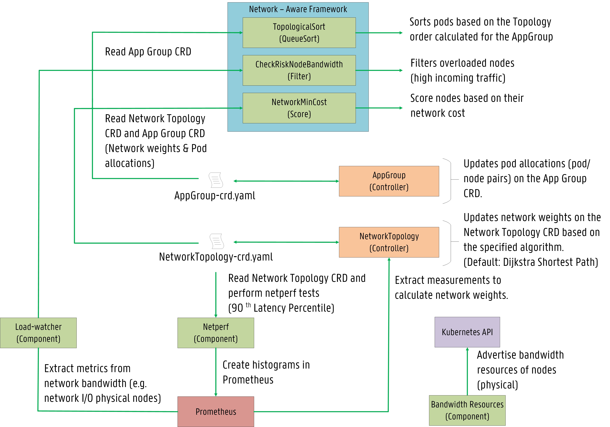
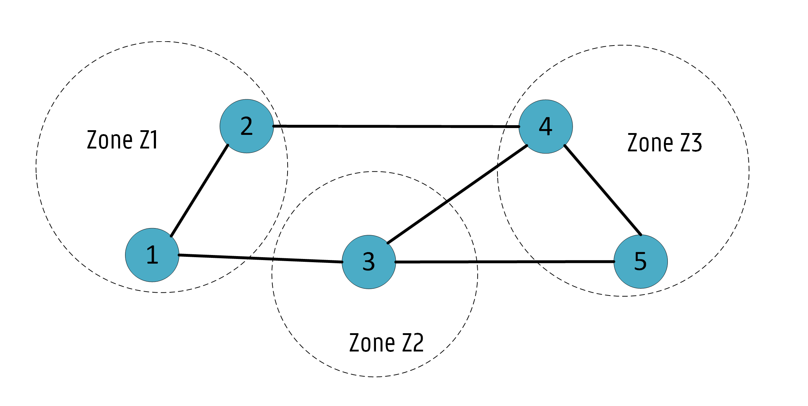
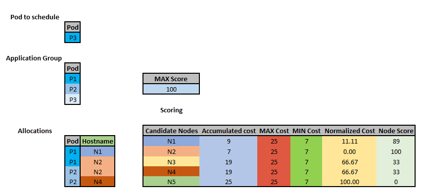

# Network-Aware Scheduling

## Table of Contents

<!-- toc -->
- [Summary](#summary)
- [Motivation](#motivation)
  - [Goals](#goals)
  - [Non-Goals](#non-goals)
- [Use cases/Topologies](#use-cases--topologies)
  - [1 - Cluster](#1---cluster)
  - [2 - Data Center (DC)](#2---data-center-dc)
  - [3 - Multi-Region](#3---multi-region)
  - [Conclusion](#conclusion)
- [Proposal - Design & Implementation Details](#proposal---design--implementation-details)
  - [Overview of the System Design](#overview-of-the-system-design)
  - [Application Group CRD (AppGroup)](#application-group-crd-appgroup)
  - [Network Topology CRD (NetTopology)](#network-topology-crd-networktopology)
  - [The inclusion of bandwidth in the scheduling process](#the-inclusion-of-bandwidth-in-the-scheduling-process)
    - [Bandwidth Requests via extended resources](#bandwidth-requests-via-extended-resources)
    - [Bandwidth Limitations via the Bandwidth CNI plugin](#bandwidth-limitations-via-the-bandwidth-cni-plugin)
  - [Netperf component](#netperf-component---measuring-latency-in-the-cluster)  
  - [Plugins](#plugins)
    - [Description of the `NetworkMinCost` Algorithm](#description-of-the-networkmincost-algorithm)
- [Known limitations](#known-limitations)
- [Test plans](#test-plans)
- [Production Readiness Review Questionnaire](#production-readiness-review-questionnaire)
    - [Scalability](#scalability)
    - [Troubleshooting](#troubleshooting)
- [Graduation criteria](#graduation-criteria)
- [Implementation history](#implementation-history)
<!-- /toc -->

<!-- Comment:
    - [Description of the `CheckRiskNodebandwidth` Algorithm](#description-of-the-checkrisknodebandwidth-algorithm)
-->

# Summary

This document describes the behaviour of the Network-Aware Scheduling framework 
that considers latency and bandwidth in the scheduling decision making process.
Service topology information (e.g., Pod dependencies) is established via an **AppGroup CRD**, 
while network topology information (e.g., network weights) is provided through a **NetworkTopology CRD**.
Bandwidth resources are advertised as **extended resources**. Several plugins are planned including: 
`TopologicalSort`, `CheckRiskNodebandwidth` and `NetworkMinCost`.  

# Motivation

Recent applications are demanding lower latency.
Scheduling pods only focused on reducing costs are not suitable for applications where low latency plays a major role. 
Applications such as the Internet of Things (IoT) and video services 
would benefit the most from plugins where latency and bandwidth are considered in the decision process 
and not only resource usages (e.g., CPU and RAM). 

Several organizations face latency when using cloud services. 
Distance from servers is usually the primary culprit. 
The best strategy is to reduce the latency between services belonging to the same application. 
This work is inspired by [Service Function Chaining](https://www.sciencedirect.com/science/article/pii/S1084804516301989).
Also, bandwidth plays an important role since overloaded nodes would degrade performance. 

We propose a **Network-Aware framework** for Kubernetes focused on delivering low latency to end-users 
and ensuring bandwidth conservation during pod allocations. 

This work significantly extends the previous work open-sourced [here](https://github.com/jpedro1992/sfc-controller) based on the old scheduler extender process.  

## Goals

- Provide a network-aware framework to extend scheduling features of Kubernetes by considering latency and bandwidth.
- Consider different pods as an Application:    
    - The creation of an **Application Group (AppGroup) CRD**
- Mapping the cluster infrastructure into zones and nodes:
    - The creation of a **Network Topology (NetworkTopology) CRD**: 
- Establish a specific order to allocate Pods based on their AppGroup CRD.
    - Implementation of a **QueueSort** plugin based on [Topology Sorting](https://en.wikipedia.org/wiki/Topological_sorting#:~:text=In%20computer%20science%2C%20a%20topological,before%20v%20in%20the%20ordering.)
- The advertising of the nodes (physical) bandwidth capacity as [extended resources](https://kubernetes.io/docs/tasks/administer-cluster/extended-resource-node/): 
    - bandwidth requests and limitations allow to filter overloaded nodes (bandwidth) considered for scheduling.
    - consider bandwidth requests for scoring plugins (e.g., `MostRequested`, `BalancedAllocation`) 
- Evaluate the risk of allocating pods on nodes based on their current demand (network bandwidth).
    - Implementation of a **Filter** plugin based on the [Trimaran load-aware scheduler](https://github.com/kubernetes-sigs/scheduler-plugins/tree/master/pkg/trimaran).    
- Near-optimal scheduling decisions based on latency:
    - Implementation of **Score** plugins based on the [Dijkstra Shortest Path calculation](https://www.geeksforgeeks.org/dijkstras-shortest-path-algorithm-greedy-algo-7/).

## Non-Goals

- Descheduling due to unexpected outcomes is not addressed in the initial design.
- As the default option, we plan to combine our plugin with other scoring functions: `RequestedToCapacityRatio` and `BalancedAllocation`. A higher weight must be given to our plugin ensuring low latency is preferred. 
Further evaluations will follow to measure the impact / interoperability with other plugins but are out of the scope of the initial design.   

## Use cases / Topologies 

We consider that our plugin is useful in all types of infrastructures. 
In this document, we analyze in more detail three topologies: **cluster**, **data centers** and **multi-region** infrastructures. 
We believe that our plugin finds the best nodes for pod allocations concerning latency and bandwidth even under complex constraints (e.g., [pod and zone anti-affinity rules](https://kubernetes.io/docs/concepts/scheduling-eviction/assign-pod-node/)).  

### 1 - Cluster 

Even small cluster topologies benefit from our plugins. 
Network weights can be different among the nodes in the infrastructure, impacting the application's response time. 
If latency or bandwidth are not considered in the scheduling process, pods from the same application can be allocated 
far from each other, increasing response time. 
Or even pods can be allocated on overloaded nodes (i.e., high incoming traffic), causing performance degradation. 
 


### 2 - Data Center (DC)


DC topologies should provide high scalability and low latency. 
Latency is a critical requirement for several applications (e.g., financial, [Apache Spark](https://spark.apache.org/), [Redis cluster](https://redis.io/topics/cluster-tutorial)). 
Also, bandwidth plays an important role since pods can be allocated in the same zone when there is not enough bandwidth for the proper operation of all pods.


### 3 - Multi-Region

Multi-region or Geo-distributed scenarios benefit the most from our plugins. 
High latency is a big concern in these topologies, especially for IoT applications (e.g., [Eclipse Hono](https://github.com/eclipse/hono), [Eclipse Cloud2Edge](https://www.eclipse.org/packages/packages/cloud2edge/))


### Conclusion

Efficient pod allocations depend on the infrastructure topology and correspondent resources. 
Available bandwidth capacity and network delays must be considered in the scheduling process.
In this work, we are concerned about microservice dependencies inspired by Service Function Chaining. 
An application is composed of different pods with established connections that directly impact the application's performance. 

For example, in the Redis cluster application, there are several dependencies among the masters and the slaves:


Also, in the Cloud2Edge platform, there are several dependencies among the several APIs and MQTT brokers where devices connect to:


The following sections describe the main ideas and implementation details to establish service chaining in Kubernetes 
and consider bandwidth and latency in the scheduling process.

# Proposal - Design & Implementation details

## Overview of the System Design

As an initial design, we plan to implement three plugins:  
- A **QueueSort** function called `TopologicalSort`. 
- A **Filter** function called `CheckRiskNodebandwidth`. 
- A **Score** function called `NetworkMinCost`. 

First, pods are sorted based on their established dependencies. Then, candidate nodes are filtered out based on their current network bandwidth to remove nodes with high incoming traffic. Lastly, nodes are scored based on network weights ensuring network latency is 
minimized for pods belonging to the same application. 

This is established via a [Custom Resource Definition (CRD)](https://kubernetes.io/docs/concepts/extend-kubernetes/api-extension/custom-resources/)
called Application Group (AppGroup).

Also, another CRD named NetworkTopology (NetworkTopology) maps the infrastructure into zones and nodes so that network weights can be calculated and then used by the scoring plugin. 

Further explanations are given below on how the proposed plugins interact with both CRDs. 



## Application Group CRD (AppGroup)

We designed an AppGroup CRD for service chains based on the [Pod Group](https://github.com/kubernetes-sigs/scheduler-plugins/tree/master/kep/42-podgroup-coscheduling) concept introduced for the [Co-scheduling](https://github.com/kubernetes-sigs/scheduler-plugins/blob/master/pkg/coscheduling/README.md) plugin. 
The PodGroup establishes a collection of pods of the same type, while the proposed AppGroup associates different pods.
The goal is to establish pod dependencies based on service topology information and record pod allocations (i.e, node/pod pairs) under the status part of the CRD. 

```yaml
# App Group CRD spec
apiVersion: apiextensions.k8s.io/v1
kind: CustomResourceDefinition
metadata:
  annotations:
    api-approved.kubernetes.io: "To be Defined" # edited manually
    controller-gen.kubebuilder.io/version: v0.6.2
  creationTimestamp: null
  name: appgroup.scheduling.sigs.k8s.io
spec:
  group: scheduling.sigs.k8s.io
  names:
    kind: AppGroup
    listKind: AppGroupList
    plural: Appgroups
    shortNames:
      - ag
      - ags
    singular: appgroup
  scope: Namespaced
  versions:
  - name: v1alpha1
    schema:
      openAPIV3Schema:
        description: AppGroup establishes a service dependency graph among different Pods.
        properties:
          apiVersion:
            description: 'APIVersion defines the versioned schema of this representation
              of an object. Servers should convert recognized schemas to the latest
              internal value, and may reject unrecognized values. More info: https://git.k8s.io/community/contributors/devel/sig-architecture/api-conventions.md#resources'
            type: string
          kind:
            description: 'Kind is a string value representing the REST resource this
              object represents. Servers may infer this from the endpoint the client
              submits requests to. Cannot be updated. In CamelCase. More info: https://git.k8s.io/community/contributors/devel/sig-architecture/api-conventions.md#types-kinds'
            type: string
          metadata:
            type: object
          spec:
              description: AppGroup defines the number of Pods and which Pods belong to the group.
              properties:
                numMembers:
                  format: int32
                  type: integer
                  minimum: 1
                  description: Number of Pods belonging to the App Group
                topologySortingAlgorithm:
                  type: string
                  description: The algorithm for TopologyOrder(Status)
                Pods:
                  type: array
                  description: The Pods belonging to the group
                  items:
                    type: object
                    properties:
                      name:
                        type: string
                        description: Pod Name
                      type:
                        type: string
                      required:
                        - name
                        - type
                      dependencies:
                        type: array
                        items:
                          type: object
                          properties:
                            description: Definition of Pod Affinities
                              name:
                                description: Name of the Pod.
                                type: string
                              type:
                                type: string
                              required:
                                - name
                                - type
                            type: object
          status:
            description: Record Pod Allocations (Pod id, hostnames).
            properties:
              runningPods:
                description: The number of actively running pods.
                format: int32
                type: integer
                minimum: 0
              podsScheduled:
                type: array
                additionalProperties:
                  name:
                    type: string
                    description: Pod Name
                  replicaID:
                    type: string
                    description: Pod ID
                  hostname:
                    type: string
                    description: Hostname allocating Pod instance
              scheduleStartTime:
                description: ScheduleStartTime of the AppGroup
                format: date-time
                type: string
              topologyCalculationTime:
                description: topologyCalculationTime of the AppGroup
                format: date-time
                type: string
              topologyOrder:
                description: The optimal order to schedule pods on this App Group based on a given algorithm.
                type: array
                items:
                  description: Pod Name and Pod Priority index
                  type: object
                    podName:
                      type: string
                      description: Pod Name
                    index:
                      type: integer
                      default: 1
                      minimum: 1
                      format: int64
                      description: Priority index for each Pod (e.g., 1, 2, ...)
                        (1 means pod should be scheduled first in the AppGroup)
            type: object
        type: object
    served: true
    storage: true
status:
  acceptedNames:
    kind: ""
    plural: ""
  conditions: []
  storedVersions: []
```

### Example


```yaml
# Example App Group CRD spec
apiVersion: scheduling.sigs.k8s.io/v1alpha1
kind: AppGroup
metadata:
  name: A1
spec:
  numMembers: 3
  topologySortingAlgorithm: KahnSort
  Pods:
    - name: P1
      type: Pod
      dependencies:
        - name: P2
          type: Pod
    - name: P2
      type: Pod
      dependencies:
        - name: P3
          type: Pod
    - name: P3
      type: Pod
```

An AppGroup controller updates the AppGroup CRD under status regarding pods scheduled in the cluster and topology order. 
Currently, four algorithms are supported for topological sorting: KahnSort, TarjanSort, ReverseKahn, ReverseTarjan. The implementation is based on the work open-sourced [here](https://github.com/otaviokr/topological-sort) 
A priority index is given to each pod based on the sorting algorithm. An order equal to 1 means the pod should be allocated first in the AppGroup.

```go
// AppGroupController is a controller that process App groups using provided Handler interface
type AppGroupController struct {
	eventRecorder   record.EventRecorder
	agQueue         workqueue.RateLimitingInterface
	agLister        schedlister.AppGroupLister
	podLister       corelister.PodLister
	agListerSynced  cache.InformerSynced
	podListerSynced cache.InformerSynced
	agClient        schedclientset.Interface
}
```

```go
// AppGroupStatus represents the current state of a app group.
type AppGroupStatus struct {
	// The number of actively running pods.
	// +optional
	RunningPods int32 `json:"runningPods,omitempty"`

	// PodsScheduled defines pod allocations (pod name, pod id, hostname).
	// +optional
	PodsScheduled ScheduledList `json:"scheduled,omitempty"`

	// ScheduleStartTime of the group
	ScheduleStartTime metav1.Time `json:"scheduleStartTime,omitempty"`

	// TopologyCalculationTime of the group
	TopologyCalculationTime metav1.Time `json:"topologyCalculationTime,omitempty"`

	// Topology order for TopSort Algorithms
	TopologyOrder TopologyList `json:"topologyOrder,omitempty"`
}

// AppGroupPodsScheduled represents the Pod Affinities of a given Pod
// +protobuf=true
type AppGroupPodsScheduled struct {
	Name      string `json:"name" protobuf:"bytes,1,opt,name=name"`
	ReplicaID string `json:"replicaID" protobuf:"bytes,2,opt,name=replicaID"`
	Hostname  string `json:"hostname,omitempty" protobuf:"bytes,3,opt,name=hostname"`
}

// ScheduledList contains an array of Pod Affinities.
// +protobuf=true
type ScheduledList []AppGroupScheduled

// AppGroupTopology represents the calculated order for the given AppGroup
// +protobuf=true
type AppGroupTopology struct {
	PodName string `json:"podName" protobuf:"bytes,1,opt,name=podName"`
	Index   int64  `json:"index" protobuf:"bytes,2,opt,name=index"`
}

// TopologyList contains an array of Pod orders for TopologySorting algorithm.
// +protobuf=true
type TopologyList []AppGroupTopology
```

### AppGroup Test based on Online Boutique

In this test, an AppGroup is created for the [Online Boutique application](https://github.com/GoogleCloudPlatform/microservices-demo).
It consists of 10 pods, which we named from P1 - P10. 


As shown below, the preferred order for the KahnSort algorithm is P1, P10, P9, P8, P7, P6, P5, P4, P3, P2. 
We attribute a **priority index** to each pod so that we can evaluate their topology order in the **Less function of the TopologicalSort plugin**.
The topology list corresponds to:

```go
topologyList = [(P1 1) (P10 2) (P9 3) (P8 4) (P7 5) (P6 6) (P5 7) (P4 8) (P3 9) (P2 10)]
```


## Network Topology CRD (NetworkTopology)

We also designed a NetworkTopology CRD based on the current [NodeResourceTopology CRD](https://github.com/kubernetes-sigs/scheduler-plugins/tree/master/pkg/noderesourcetopology).
The goal is to map the cluster infrastructure into zones and nodes. Nodes are assigned a different zone or location.  
Then, under the status part, network costs are updated based on a specified algorithm. 

As a design decision, we plan to deploy a NetworkTopology CRD for each node. We argue that establishing a single CRD for all nodes might reduce the system performance concerning execution time to find the network weights for a given node. In contrast, deploying multiple CRDs will have an impact on memory. We plan to perform experiments to evaluate the performance and feasibility of the NetworkTopology CRD per node. 

```yaml
# Network CRD spec
apiVersion: apiextensions.k8s.io/v1
kind: CustomResourceDefinition
metadata:
  annotations:
    api-approved.kubernetes.io: "To be Defined" # edited manually
    controller-gen.kubebuilder.io/version: v0.6.2
  creationTimestamp: null
  name: networkTopology.scheduling.sigs.k8s.io # OR netTopology.topology.node.k8s.io?
spec:
  group: scheduling.sigs.k8s.io # OR topology.node.k8s.io?
  names:
    kind: NetworkTopology
    listKind: NetworkTopologyList
    plural: networktopologies
    shortNames:
    - net-topo
    - nt
    singular: networktopology
  scope: Namespaced
  versions:
  - name: v1alpha1
    schema:
      openAPIV3Schema:
        description: NetTopology describes the node network topology.
        properties:
          apiVersion:
            description: 'APIVersion defines the versioned schema of this representation
              of an object. Servers should convert recognized schemas to the latest
              internal value, and may reject unrecognized values. More info: https://git.k8s.io/community/contributors/devel/sig-architecture/api-conventions.md#resources'
            type: string
          kind:
            description: 'Kind is a string value representing the REST resource this
              object represents. Servers may infer this from the endpoint the client
              submits requests to. Cannot be updated. In CamelCase. More info: https://git.k8s.io/community/contributors/devel/sig-architecture/api-conventions.md#types-kinds'
            type: string
          metadata:
            type: object
          spec:
            type: object
            properties:
              topologyAlgorithm:
                type: string
                description: The algorithm for weight calculation (Status)
              zones:
                description: ZoneList contains an array of Zones in the infrastructure.
                items:
                  description: Zone represents a topology zone.
                  properties:
                    name:
                      type: string
                    type:
                      type: string
                    resources:
                      description: ResourceInfoList contains an array of ResourceInfo
                        objects.
                      items:
                        description: ResourceInfo contains information about one resource
                          type.
                        properties:
                          name:
                            type: string
                            description: Name of the resource.
                          type:
                            type: string
                            description: Type of the resource (e.g., node).
                      type: object
                  type: array
                required:
                - name
                - type
                type: object
          status:
            description: Record Network Weights among zones and nodes.
            properties:
              weights:
                type: array
                description: weightList contains an array of weightInfo objects.
                items:
                  algorithmName:
                    type: string
                    description: Algorithm Name
                  costList:
                    description: Record weights for several nodes based on the algorithm
                      type: object
                      properties:
                        destination:
                          type: string
                          description: Node / zone name (Destination)
                        cost:
                          type: integer
                          default: 0
                          minimum: 0
                          format: int64
                          description: Cost from Origin (Node) to Destination (Node / Zone)
                        type: object
            type: object
        type: object
    served: true
    storage: true
status:
  acceptedNames:
    kind: ""
    plural: ""
  conditions: []
  storedVersions: []
```

### Example



```yaml
# Example Network CRD 
apiVersion: scheduling.sigs.k8s.io/v1alpha1
kind: NetworkTopology
metadata:
  name: worker-1
  namespace: test-namespace
spec:
  topologyAlgorithm: Dijkstra
  zones:
    - name: z1
      type: Zone
      resources:
        - name: worker-1
          type: Node
        - name: worker-2
          type: Node
    - name: z2
      type: Zone
      resources:
        - name: worker-3
          type: Node
    - name: z3
      type: Zone
      resources:
        - name: worker-4
          type: Node
        - name: worker-5
          type: Node
```

An NetworkTopology controller updates the CRD under status regarding network weights calculated based on the specified algorithm.   

```go
// NetworkTopologyController is a controller that process Network Topology using provided Handler interface
type NetworkTopologyController struct {
	eventRecorder    record.EventRecorder
	ntQueue          workqueue.RateLimitingInterface
	ntLister         schedlister.NetworkTopologyLister
	nodeLister       corelister.NodeLister
	ntListerSynced   cache.InformerSynced
	nodeListerSynced cache.InformerSynced
	ntClient         schedclientset.Interface
}
```

```go
// NetworkTopologyStatus represents the current state of a Network Topology.
type NetworkTopologyStatus struct {
	// The calculated weights in the topology.
	// +optional
	Weights NetworkTopologyWeightList `json:"weights,omitempty"`
}

// NetworkTopologyWeightList contains an array of NetworkTopologyWeightInfo objects.
// +protobuf=true
type NetworkTopologyWeightList []NetworkTopologyWeightInfo

// NetworkTopologyResourceInfo contains information about one resource type.
// +protobuf=true
type NetworkTopologyWeightInfo struct {
	// Preferred Algorithms
	AlgorithmName string `json:"algorithmName" protobuf:"bytes,1,opt,name=algorithmName"`

	// Costs from a given Origin to a given Destination
	CostList NetworkTopologyCostList `json:"costList" protobuf:"bytes,2,opt,name=costList"`
}

// NetworkTopologyAlgorithmList contains an array of NetworkTopologyAlgorithmInfo objects.
// +protobuf=true
type NetworkTopologyCostList []NetworkTopologyCostInfo

// NetworkTopologyResourceInfo contains information about one resource type.
// +protobuf=true
type NetworkTopologyCostInfo struct {
	// Name of the origin (e.g., Node Name).
	Destination string `json:"destination" protobuf:"bytes,1,opt,name=destination"`

	// Network Cost
	Cost int64 `json:"cost" protobuf:"bytes,2,opt,name=cost"`
}
```

## The inclusion of bandwidth in the scheduling process 

### Bandwidth Requests via extended resources

We plan to advertise the node's (physical) bandwidth capacity of the cluster via [extended resources](https://kubernetes.io/docs/tasks/administer-cluster/extended-resource-node/). 
A bandwidth resource component will be developed to send HTTP requests to the Kubernetes API server regarding the node's bandwidth capacity:

```HTTP
PATCH /api/v1/nodes/<your-node-name>/status HTTP/1.1
Accept: application/json
Content-Type: application/json-patch+json
Host: k8s-master:8080

[
  {
    "op": "add",
    "path": "/status/capacity/network.aware.com~1bandwidth",
    "value": "10000000000" 
  }
]
```

Here, the bandwidth capacity of the node is equal to 10 Gbps. 
We prefer to specify bandwidth in sizes of 1 bps (bits per second):

- 1 Mbit/s = 1000000
- 1 Gbit/s = 1000000000
- 10 Gbit/s = 10000000000

The output will show that the Node has a capacity of 10 Gbps:

```HTTP
"capacity": {
  "cpu": "2",
  "memory": "2049008iK",
  "network.aware.com/bandwidth": "10000000000",
```

### Bandwidth Limitations via the Bandwidth CNI plugin

The [bandwidth CNI plugin](https://kubernetes.io/docs/concepts/extend-kubernetes/compute-storage-net/network-plugins/) 
supports pod ingress and egress traffic shaping to limit container bandwidth.
Containers share the host network bandwidth when deployed on the same node. 
Limiting container bandwidth can prevent mutual interference and improve network stability.

The addition of `kubernetes.io/ingress-bandwidth` and `kubernetes.io/egress-bandwidth` annotations 
to the pod configuration file ensures bandwidth limitations are respected:

```yaml
# Example Pod deployment with bandwidth limitations
apiVersion: v1
kind: Pod
metadata:
  annotations:
    kubernetes.io/ingress-bandwidth: 1M
    kubernetes.io/egress-bandwidth: 1M
 ``` 

### Example 

This example shows how extended resources can be combined with bandwidth limitations in the pod configuration file:

```yaml
# Example Pod deployment:  
# bandwidth requests (Extended Resources)
# bandwidth limitations (bandwidth CNI plugin)
apiVersion: v1
kind: Pod
metadata:
  name: network-aware-plugin-example
  annotations:
      kubernetes.io/ingress-bandwidth: 10M
      kubernetes.io/egress-bandwidth: 10M
spec:
  containers:
  - name: network-aware-plugin-example
    image: example
    resources:
      requests:
        network.aware.com/bandwidth: 10000000 # 10M
      limits:
        network.aware.com/bandwidth: 10000000 # 10M  
 ``` 

This allows to perform filter / score algorithms (e.g., `PodFitsHostResources`, `MostRequested`, `BalancedAllocation`) based on bandwidth resources.

## Netperf component - measuring Latency in the cluster

Latency will be monitored through a [netperf](https://github.com/HewlettPackard/netperf) component. 
Netperf tests will be executed based on the nodes available in the infrastructure. 
This allows to measure the latency between nodes / zones. 
As an initial design, we are focused on the **90th percentile latency**.


We plan to create Histograms in [Prometheus](https://prometheus.io/) with the measured values.

To address scalability concerns, network weights are calculated by the controller (NetworkTopology) under status for each node. 

The controller builds the network graph based on topology information (i.e., zones, nodes) available in the NetTopology CRD 
and updates the network weights for the given node based on the Netperf measurements available in Prometheus. 

The cached graph in the controller is recalculated based on new measurements. These updates can be configured 
for a certain period (e.g., every 1 min, every 5 minutes, every 10 minutes). 

As a default algorithm, the [Dijkstra Shortest Path](https://www.geeksforgeeks.org/dijkstras-shortest-path-algorithm-greedy-algo-7/) will be implemented.

Typically, the time complexity of the Dijkstra algorithm is: `O (V + E log V)`, where V corresponds to Vertices and E to Edges in the infrastructure.  

We acknowledge the overhead introduced by our controller and corresponding `NetworkMinCost` plugin. 
However, to make better decisions concerning latency, we need accurate and up-to-date information regarding cluster latency. 

Experiments are planned to evaluate the overhead of our design in different topologies.
We also aim to study the frequency of the Netperf measurements and the trade-off between monitoring frequencies and accuracy.
 
At a later stage, other algorithms for weight calculation can be added and supported (e.g., [Bellman Ford](https://www.geeksforgeeks.org/bellman-ford-algorithm-dp-23/)).

The component will be developed based on [k8s-netperf](https://github.com/leannetworking/k8s-netperf) and open-sourced [here](ADD LINK TO REPO!!!)

## Network-Aware Plugins

### Description of the `TopologicalSort` Algorithm

**Extension point: QueueSort**

TODO

### Description of the `CheckRiskNodebandwidth` Algorithm

**Extension point: Filter**

Allocating pods on nodes without considering their current demand (bandwidth) could be risky. 
The `CheckRiskNodebandwidth` plugin evaluates the risk of allocating pods on certain nodes based on their network bandwidth (i.e., network I/O). 
It is based on the `LoadVariationRiskBalancing` plugin developed for the [Trimaran scheduler](https://github.com/kubernetes-sigs/scheduler-plugins/tree/master/pkg/trimaran).

The plugin employs the `load-watcher` component to collect measurements from the nodes as described [here](https://github.com/kubernetes-sigs/scheduler-plugins/tree/master/pkg/trimaran).

The (normalized) node risk is defined as a combined measure of the **average** (i.e., avg) and **standard deviation** (i.e., std) of the node bandwidth utilization. 
It is given by

```latex
node_risk = [avg + margin * std^{1/sensitivity}] / 2
```

The two parameters: **margin**​ and **sensitivity**​, impact the amount of risk due to bandwidth variation. 
To magnify the impact of low variations, the **std** quantity is raised to a fractional power with the **sensitivity** parameter being the root power, while the **margin** parameter scales the variation quantity. 
The recommended values for the margin​ and sensitivity parameters are 1 and 2, respectively. 
Each of the two added terms is bounded between 0 and 1. Then, dividing by 2 normalizes the node risk between 0 and 1.

Then, if the **node_risk** is higher than the `RiskThreshold` defined in the scheduler config file, the node is removed and not considered for scoring. 

```go
func (rs *resourceStats) evaluateRisk(margin float64, sensitivity float64, riskThreshold float64) bool {
    
    // make sure values are within bounds
    rs.req = math.Max(rs.req, 0)
    rs.usedAvg = math.Max(math.Min(rs.usedAvg, rs.capacity), 0)
    rs.usedStdev = math.Max(math.Min(rs.usedStdev, rs.capacity), 0)

    // calculate average factor
    mu := (rs.usedAvg + rs.req) / rs.capacity
    mu = math.Max(math.Min(mu, 1), 0)

    // calculate deviation factor
    sigma := rs.usedStdev / rs.capacity
    sigma = math.Max(math.Min(sigma, 1), 0)
	
    // apply root power
    if sensitivity >= 0 {
	    sigma = math.Pow(sigma, 1/sensitivity)
    }

    // apply multiplier
    sigma *= margin
    sigma = math.Max(math.Min(sigma, 1), 0)

    // Calculate node risk
    nodeRisk := (mu + sigma) / 2
    klog.V(6).Infof("mu=%f; sigma=%f; margin=%f; sensitivity=%f; risk=%f", mu, sigma, margin, sensitivity, nodeRisk)

    // Return if the calculated nodeRisk passes the RiskThreshold (bool)
    return fitsThreshold(riskThreshold, nodeRisk)
}
```

Thus, the `CheckRiskNodebandwidth` plugin has the three following configuration parameters:

- `safeVarianceMargin`: Multiplier (non-negative floating point) of standard deviation. (Default: 1)
- `safeVarianceSensitivity`: Root power (non-negative floating point) of standard deviation. (Default: 2)
- `RiskThreshold`: The threshold for the node risk (between 0 and 1). Nodes with higher risk are filtered out. (Default: 0.75)

In summary, the `CheckRiskNodebandwidth` plugin filters out nodes with a high risk of the bandwidth exceeding the node available capacity. 

#### Example

Let's consider that our cluster has three nodes`N1 - N3`, and the pod to be scheduled has a bandwidth requirement of 100 Mbps (Bandwidth). 
All nodes have a link capacity of 1 Gbps.
The mean (M) and standard deviation (V) are extracted from the load-watcher component. Otherwise, we assume that M and V are the requested amount and zero, respectively.
The `node_risk` is calculated for all nodes. 
As a result, both `N1`, `N2` will be considered for scoring, 
while `N3` is filtered out due to its **high risk (0.787).**


### Description of the `NetworkMinCost` Algorithm

**Extension point: Score**

We propose a scoring plugin called `NetworkMinCost` to favor nodes with the lowest combined cost based on the pod AppGroup.

Pod allocations (pod name, pod id, pod hostname) are available in the AppGroup CRD updated by the controller under the status part. 

Network weights are available in the NetworkTopology CRD updated by the controller based on the Netperf measurements in Prometheus. 
 
If not a single pod belonging to the same AppGroup has been already allocated, 
we score all candidate nodes equally: 

```go
score := framework.MinNodeScore

// Check if Pod belongs to an App Group
agName := util.GetAppGroupLabel(pod)
if len(agName) == 0 { // Score all nodes equally
	return score, framework.NewStatus(framework.Success, "Pod does not belong to an AppGroup: minimum score")
}
```

We plan to combine our scoring plugin with resource scoring plugins (e.g., `BalancedAllocation`, `LeastRequestedPriority`). 
We will attribute a higher weight to our plugin to prefer decisions focused on low latency. 
For instance, consider the following scheduler policy config file as an example:

```json
{
"kind" : "Policy",
"apiVersion" : "v1",
"predicates" : [
	{"name" : "PodFitsPorts"},
	{"name" : "PodFitsResources"},
	{"name" : "NoDiskConflict"},
	{"name" : "NoVolumeZoneConflict"},
	{"name" : "MatchNodeSelector"},
	{"name" : "HostName"}
],
"priorities" : [
	{"name" : "LeastRequestedPriority", "weight" : 1},
	{"name" : "BalancedResourceAllocation", "weight" : 1},
	{"name" : "NetworkMinCost", "weight" : 5}
]
}
```
  
#### Example

##### Build the Network Graph 

Let's consider that our cluster has five nodes `N1 - N5` and three zones `Z1 - Z3`.
The spec definition of the NetTopology CRD is the following: 

```yaml
# Example Network CRD 
apiVersion: topology.node.k8s.io/v1alpha1
kind: NetworkTopology
metadata:
  name: network-A
  namespace: test-namespace
spec:
  zones:
    - name: zone-z1
      type: Zone
      resources:
        - name: node-1
          type: Node
        - name: node-2
          type: Node
    - name: zone-z2
      type: Zone
      resources:
        - name: node-3
          type: Node
    - name: zone-z3
      type: Zone
      resources:
        - name: node-4
          type: Node
        - name: node-5
          type: Node
```

And at a given moment, the status part in the NetTopology CRD is the following:

```yaml
# Status from Network CRD 
(...)
          status:
            properties:
              weights:
                - name: node-1
                  items:
                    - name: node-2
                      algorithm: Dijkstra
                      cost: 1 
                    - name: node-3
                      algorithm: Dijkstra
                      cost: 4 
                - name: node-2
                  items:
                    - name: node-4
                      algorithm: Dijkstra
                      cost: 6 
                - name: node-3
                  items:
                    - name: node-4
                      algorithm: Dijkstra
                      cost: 5 
                    - name: node-5
                      algorithm: Dijkstra
                      cost: 3
                - name: node-4
                   items:
                     - name: node-5
                       algorithm: Dijkstra
                       cost: 2 
```

Based on the NetTopology CRD, the controller will create the following network graph:
 


##### Score nodes for a given pod based on the AppGroup CRD 

Let's consider that we need to schedule the pod `P3` belonging to the Application group `A1`, 
containing three pods `P1 - P3` with established dependencies:

```yaml
# Example App Group CRD spec
apiVersion: scheduling.sigs.k8s.io/v1alpha1
kind: AppGroup
metadata:
  name: A1
spec:
  numMembers: 3
  Pods:
    - name: P1
      type: Pod
      dependencies:
        podAffinity: P2, P3
    - name: P2
      type: Pod
      dependencies:
        podAffinity: P1, P3
    - name: P3
      type: Pod
      dependencies:
        podAffinity: P1, P2
```

At a given moment, the status part is the following: 

 ```yaml
# Status from App Group CRD 
(...)        
          status: 
            properties:
              scheduled:
                - name: P1
                  type: Pod
                  replicaID: pod1-testtest-test1
                  hostname: node-1
                - name: P1
                  type: Pod
                  replicaID: pod1-testtest-test2
                  hostname: node-2
                - name: P2
                  type: Pod
                  replicaID: pod2-testtest-test1
                  hostname: node-2
                - name: P1
                  type: Pod
                  replicaID: pod2-testtest-test2
                  hostname: node-4
                  
```

Four pods have already been allocated: two replicas of `P1` and two replicas of `P2`. 

First, we calculate the accumulated shortest path cost for all candidate nodes. 

Second, we normalize (between 0 and 100) the accumulated cost for all nodes as the following: 

```latex
MAX_SCORE = 100
min_cost = min(all_costs)
max_cost = max(all_costs)

node_normalized_cost = MAX_SCORE * ( ( node_cost - min_cost) / (max_cost - min_cost)
``` 

Then, the node score is computed as the following, assuming that lower costs correspond to lower latency:

```latex
score = MAX_SCORE - node_normalized_cost
```

Thus, nodes with lower costs are favored. 



# Known limitations

TO DO

# Test plans

Unit tests and Integration tests will be added.

# Production Readiness Review Questionnaire

## Scalability

*   Will enabling / using this feature result in any new API calls? 

    No.

*   Will enabling / using this feature result in introducing new API types? 

    No.

*   Will enabling / using this feature result in any new calls to the cloud provider? 

    No.

*   Will enabling / using this feature result in increasing size or count of the existing API objects? 

    No.

*   Will enabling / using this feature result in increasing time taken by any operations covered by [existing SLIs/SLOs](https://git.k8s.io/community/sig-scalability/slos/slos.md#kubernetes-slisslos)? 

    It should be a negligible increase concerning execution time since our scoring plugin extracts topology information from the NetTopology CRD 
    and application information from the AppGroup CRD. 
    All network weights are pre-calculated by the controller and updated in the status part of the CRD to minimize the overhead of the scoring plugin. 
    We will perform several experiments to evaluate the impact of our design.

*   Will enabling / using this feature result in non-negligible increase of resource usage (CPU, RAM, disk, IO, ...) in any components? 

    No - Metrics / Information are available in both CRDs and only pulled by our plugins when needed. 
    It should be a negligible increase in terms of resource usage. Experiments are planned to evaluate the overhead of the 
    Netperf component and both controllers (AppGroup CRD and NetTopology CRD).  
    In addition, the algorithms provided run in linear and logarithmic time for the number of nodes.


## Troubleshooting

*   How does this feature react if the API server and/or etcd is unavailable? 

     Running pods are not affected. Any new submissions would be rejected by scheduler.

*   What are other known failure modes?

     N/A

*   What steps should be taken if SLOs are not being met to determine the problem?

     N/A

# Graduation criteria

TO DO

# Implementation history

- 2021-9-9: Presentation to the Kubernetes sig-scheduling community. 
Received feedback and comments on the design and implementation. Recording available [here](https://youtu.be/D9jSqUiaq1Q). 
- 2021-9-30: Initial KEP sent out for review, including Summary, Motivation, Proposal, Test plans and Graduation criteria.
