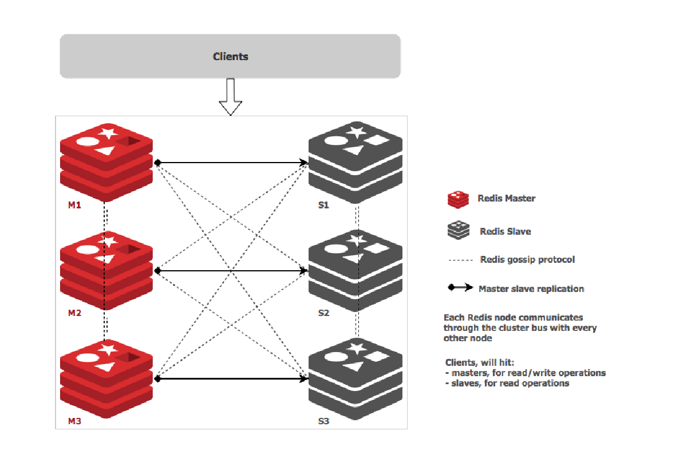

# Network-Aware Scheduling

## Table of Contents

<!-- toc -->
- [Summary](#summary)
- [Motivation](#motivation)
  - [Goals](#goals)
  - [Non-Goals](#non-goals)
- [Use cases/Topologies](#use-cases--topologies)
  - [1 - Cluster](#1---cluster)
  - [2 - Data Center (DC)](#2---data-center-dc)
  - [3 - Multi-Region](#3---multi-region)
  - [Conclusion](#conclusion)
- [Proposal - Design & Implementation Details](#proposal---design--implementation-details)
  - [Overview of the System Design](#overview-of-the-system-design)
  - [Application Group CRD (AppGroup)](#application-group-crd-appgroup)
  - [Network Topology CRD (NetTopology)](#network-topology-crd-nettopology)
  - [The inclusion of bandwidth in the scheduling process](#the-inclusion-of-bandwidth-in-the-scheduling-process)
    - [Bandwidth Requests via extended resources](#bandwidth-requests-via-extended-resources)
    - [Bandwidth Limitations via the Bandwidth CNI plugin](#bandwidth-limitations-via-the-bandwidth-cni-plugin)
  - [Netperf component](#netperf-component---measuring-latency-in-the-cluster)  
  - [Filter and Score plugins](#filter-and-score-plugins)
    - [Description of the `NetworkMinCost` Algorithm](#description-of-the-networkmincost-algorithm)
- [Known limitations](#known-limitations)
- [Test plans](#test-plans)
- [Production Readiness Review Questionnaire](#production-readiness-review-questionnaire)
    - [Scalability](#scalability)
    - [Troubleshooting](#troubleshooting)
- [Graduation criteria](#graduation-criteria)
- [Implementation history](#implementation-history)
<!-- /toc -->

<!-- Comment:
    - [Description of the `CheckRiskNodebandwidth` Algorithm](#description-of-the-checkrisknodebandwidth-algorithm)
-->

# Summary

This document describes the behaviour of the Network-Aware Scheduling plugin 
that considers latency and bandwidth in the scheduling decision making process.

# Motivation

Recent applications are demanding lower latency.
Scheduling pods only focused on reducing costs are not suitable for applications where low latency plays a major role. 
Applications such as the Internet of Things (IoT) and video services 
would benefit the most from plugins where latency and bandwidth are considered in the decision process 
and not only resource usages (e.g., CPU and RAM). 

Several organizations face latency when using cloud services. 
Distance from servers is usually the primary culprit. 
The best strategy is to reduce the latency between services belonging to the same application. 
This work is inspired by [Service Function Chaining](https://www.sciencedirect.com/science/article/pii/S1084804516301989).
Also, bandwidth plays an important role since overloaded nodes would degrade performance. 

We propose a **Network-Aware plugin** for Kubernetes focused on delivering low latency to end-users 
and ensuring bandwidth conservation during pod allocations. 

This work significantly extends the previous work open-sourced [here](https://github.com/jpedro1992/sfc-controller) based on the old scheduler extender process.  

## Goals

- Provide a network-aware plugin to extend scheduling features of Kubernetes by considering latency and bandwidth.
- The creation of an **Application Group (AppGroup) CRD**:
    - consider different pods as an AppGroup.
- The creation of a **Network Topology (NetTopology) CRD**: 
    - map the cluster infrastructure into zones / nodes. 
- The advertising of the nodes (physical) bandwidth capacity as [extended resources](https://kubernetes.io/docs/tasks/administer-cluster/extended-resource-node/): 
    - bandwidth requests and limitations allow to filter overloaded nodes (bandwdith) considered for scheduling.
    - consider bandwidth requests for scoring plugins (e.g., `MostRequested`, `BalancedAllocation`) 
- Near-optimal scheduling decisions based on latency:
    - Implementation of **Filter** and **Score** plugins for network-aware scheduling.

## Non-Goals

- Descheduling due to unexpected outcomes is not addressed in the initial design.
- As the default option, we plan to combine our plugin with other scoring functions: `RequestedToCapacityRatio` and `BalancedAllocation`. A higher weight must be given to our plugin ensuring low latency is preferred. 
Further evaluations will follow to measure the impact / interoperability with other plugins but are out of the scope of the initial design.   

## Use cases / Topologies 

We consider that our plugin is useful in all types of infrastructures. 
In this document, we analyze in more detail three topologies: **cluster**, **data centers** and **multi-region** infrastructures. 
We believe that our plugin finds the best nodes for pod allocations concerning latency and bandwidth even under complex constraints (e.g., [pod and zone anti-affinity rules](https://kubernetes.io/docs/concepts/scheduling-eviction/assign-pod-node/)).  

### 1 - Cluster 

Even small cluster topologies benefit from our scheduler, especially when response times are different. Network weights will be different among the nodes present in the cluster.
If latency or bandwidth are not considered in the scheduling process, 
pods from the same application might be allocated far from each other, or pods might be allocated on overloaded nodes, causing performance degradation. 
 


### 2 - Data Center (DC)

DC topologies should provide high scalability and low latency. Latency is a critical requirement for several applications (e.g., financial, [Apache Spark](https://spark.apache.org/), [Redis cluster](https://redis.io/topics/cluster-tutorial)). 
Also, bandwidth plays an important role since pods might be allocated in the same zone, and there is not enough bandwidth for all pods since bandwidth has not been considered in the scheduling process.


### 3 - Multi-Region

Multi-region or Geo-distributed scenarios benefit the most from our plugin. 
High latency is a big concern in these topologies, especially for IoT applications (e.g., [Eclipse Hono](https://github.com/eclipse/hono), [Eclipse Cloud2Edge](https://www.eclipse.org/packages/packages/cloud2edge/))


### Conclusion

Efficient pod allocations depend on the infrastructure topology and correspondent resources. 
Available bandwidth capacity and network delays must be considered in the scheduling process.
In this work, we are concerned about microservice dependencies inspired by Service Function Chaining. 
Different Pods have established connections that directly impact the application's performance. 

For example, in the Redis cluster application, there are several dependencies among the masters and the slaves:



Also, in the Cloud2Edge platform, there are several dependencies among the several APIs and MQTT brokers where devices connect to:


The following sections describe the main ideas and implementation details to establish service chaining in Kubernetes 
and consider bandwidth and latency in the scheduling process in Kubernetes.

# Proposal - Design & Implementation details

## Overview of the System Design

As an initial design, we plan to implement a scoring function called `NetworkMinCost`. 
The goal is to score nodes based on their network weight ensuring network latency is 
minimized for pods belonging to the same application. 
This is established via a [Custom Resource Definition (CRD)](https://kubernetes.io/docs/concepts/extend-kubernetes/api-extension/custom-resources/)
called Application Group (AppGroup). Also, another CRD named NetworkTopology (NetTopology) 
maps the Kubernetes infrastructure into zones and nodes so that network weights can be calculated. 
Further explanations are given below on how the proposed `NetworkMinCost` plugin reduces the latency 
in the cluster by using both CRDs.  


## Application Group CRD (AppGroup)

Create an AppGroup CRD for service chains based on the [Pod Group](https://github.com/kubernetes-sigs/scheduler-plugins/tree/master/kep/42-podgroup-coscheduling) concept introduced for the [Co-scheduling](https://github.com/kubernetes-sigs/scheduler-plugins/blob/master/pkg/coscheduling/README.md) plugin. 
The Pod group establishes a connection among Pods of the same type, while the proposed AppGroup creates a connection among different Pods.
The goal is to establish Pod dependencies with specific affinities and then record Pod allocations (i.e, node - pod pairs) under the status part. 

```yaml
# App Group CRD spec
apiVersion: apiextensions.k8s.io/v1
kind: CustomResourceDefinition
metadata:
  name: appgroups.scheduling.sigs.k8s.io
  annotations:
    "api-approved.kubernetes.io": "To be Defined"
spec:
  group: scheduling.sigs.k8s.io
  names:
    kind: AppGroup
    plural: Appgroups
    singular: Appgroup
    shortNames:
    - ag
    - ags
  scope: Namespaced
  versions:
  - name: "v1alpha1"
    served: true
    storage: true
    schema:
      openAPIV3Schema:
        type: object
        properties:
          spec:
            type: object
            properties:
              numMembers: # number of Pods belonging to the App Group
                type: integer
                minimum: 1
              Pods: # The Pods belonging to the Group
                type: array # 
                items:
                  type: object
                  properties:
                    name: # Pod Name 
                      type: string 
                    type: 
                      type: string
                    dependencies: # Define Pod Affinities
                      type: array
                      items:
                        type: object
                        properties:
                          podAffinity: # Specific Affinities
                            type: string
          status: # update replicas and hostnames depending on Pod Allocations
            type: object
            properties:
              scheduled:
                type: array
                additionalProperties:
                  name: # Pod name
                    type: string
                  replicaID: # Pod ID
                    type: string
                  hostname: # Hostname allocating Pod replica
                    type: string
                  
```

### Example


```yaml
# Example App Group CRD spec
apiVersion: scheduling.sigs.k8s.io/v1alpha1
kind: AppGroup
metadata:
  name: A1
spec:
  numMembers: 3
  Pods:
    - name: P1
      type: Pod
      dependencies:
        podAffinity: P2, P3
    - name: P2
      type: Pod
      dependencies:
        podAffinity: P1, P3
    - name: P3
      type: Pod
      dependencies:
        podAffinity: P1, P2
```

## Network Topology CRD (NetTopology)

Create a NetTopology CRD based on the current [NodeResourceTopology CRD](https://github.com/kubernetes-sigs/scheduler-plugins/tree/master/pkg/noderesourcetopology).
The goal is to map the cluster infrastructure into zones and nodes. 
Nodes are assigned a different zone or location.  
Then, under the status part, network costs are updated based on a specified algorithm. 
Further details are given [here]()


```yaml
# Network CRD spec
apiVersion: apiextensions.k8s.io/v1
kind: CustomResourceDefinition
metadata:
  annotations:
    "api-approved.kubernetes.io": "To be Defined"
  name: networktopology.topology.node.k8s.io
spec:
  group: topology.node.k8s.io
  names:
    kind: NetworkTopology
    plural: NetworkTopologies
    singular: NetworkTopology
    shortNames:
    - nt
    - nts
  scope: Namespaced
  versions:
  - name: "v1alpha1"
    served: true
    storage: true
    schema:
      openAPIV3Schema:
        type: object
        properties:
          spec:
            type: object
            properties:
              zones: # Nodes / Zones in the infrastructure
                type: array
                items:
                  type: object
                  properties:
                    name:
                      type: string
                    type:
                      type: string
                    parent:
                      type: string
                    resources:
                      type: array
                      items:
                        type: object
                        properties:
                           name:
                              type: string
                           type: 
                              type: string
          status:
            type: object
            properties:
              weights:
                type: array
                items:
                  type: object
                  name: # node / zone name
                    type: string
                  properties:
                    name: # node / zone name
                       type: string
                    algorithm: # name of the Algorithm
                      type: string
                    cost: # update costs
                      type: integer
                      default: 0
```

### Example


```yaml
# Example Network CRD 
apiVersion: topology.node.k8s.io/v1alpha1
kind: NetworkTopology
metadata:
  name: network-A
  namespace: test-namespace
spec:
  zones:
    - name: zone-z1
      type: Zone
      resources:
        - name: node-1
          type: Node
        - name: node-2
          type: Node
    - name: zone-z2
      type: Zone
      resources:
        - name: node-3
          type: Node
    - name: zone-z3
      type: Zone
      resources:
        - name: node-4
          type: Node
        - name: node-5
          type: Node
```

## The inclusion of bandwidth in the scheduling process 

### Bandwidth Requests via extended resources

We plan to advertise the node's (physical) bandwidth capacity of the cluster via [extended resources](https://kubernetes.io/docs/tasks/administer-cluster/extended-resource-node/). 
The Bandwidth resource component will send HTTP requests to the Kubernetes API server:

```HTTP
PATCH /api/v1/nodes/<your-node-name>/status HTTP/1.1
Accept: application/json
Content-Type: application/json-patch+json
Host: k8s-master:8080

[
  {
    "op": "add",
    "path": "/status/capacity/networkAware.com~1bandwidth",
    "value": "10000000000" 
  }
]
```

Here, the bandwidth capacity of the node is equal to 10 Gbps. 
We prefer to specify bandwidth in sizes of 1 bps (bits per second):

- 1 Mbit/s = 1000000
- 1 Gbit/s = 1000000000
- 10 Gbit/s = 10000000000

The output will show that the Node has a capacity of 10 Gbps:

```HTTP
"capacity": {
  "cpu": "2",
  "memory": "2049008iK",
  "networkAware.com/bandwidth": "10000000000",
```

### Bandwidth Limitations via the Bandwidth CNI plugin

The [bandwidth CNI plugin](https://kubernetes.io/docs/concepts/extend-kubernetes/compute-storage-net/network-plugins/
) supports pod ingress and egress traffic shaping to limit container bandwidth.
Containers share the host network bandwidth when deployed on the same node. 
Limiting container bandwidth can prevent mutual interference and improve network stability.

The addition of `kubernetes.io/ingress-bandwidth` and `kubernetes.io/egress-bandwidth` annotations 
to the pod configuration file ensures bandwidth limitations are respected:

```yaml
# Example Pod deployment with bandwidth limitations
apiVersion: v1
kind: Pod
metadata:
  annotations:
    kubernetes.io/ingress-bandwidth: 1M
    kubernetes.io/egress-bandwidth: 1M
 ``` 

### Example 

This example shows how extended resources can be combined with bandwidth limitations in the pod configuration file:

```yaml
# Example Pod deployment:  
# bandwidth requests (Extended Resources)
# bandwidth limitations (bandwidth CNI plugin)
apiVersion: v1
kind: Pod
metadata:
  name: network-aware-plugin-example
  annotations:
      kubernetes.io/ingress-bandwidth: 10M
      kubernetes.io/egress-bandwidth: 10M
spec:
  containers:
  - name: network-aware-plugin-example
    image: example
    resources:
      requests:
        networkAware.com/bandwidth: 100000   # 100K
      limits:
        networkAware.com/bandwidth: 10000000 # 10M  
 ``` 

This will allow to perform filter / score algorithms (e.g., `PodFitsHostResources`, `MostRequested`, `BalancedAllocation`) based on bandwidth.

## Netperf component - measuring Latency in the cluster

Latency will be monitored through a [netperf](https://github.com/HewlettPackard/netperf) component. 
Netperf tests will be executed based on the cluster infrastructure specified in the NetTopology CRD. 
This allows measuring the latency between cluster nodes / zones. 
As an initial design, we are focused on the **90th percentile latency**.


 Histograms are created in Prometheus with the measured values and then the controller for the NetTopology CRD will update the network weights on the CRD based on the specified algorithm. 
As a default algorithm, the [Dijkstra Shortest Path](https://www.geeksforgeeks.org/dijkstras-shortest-path-algorithm-greedy-algo-7/) will be implemented. 
At a later stage, other algorithms can be added (e.g., [Bellman Ford](https://www.geeksforgeeks.org/bellman-ford-algorithm-dp-23/)).

## Filter and Score plugins

<!-- # To Discuss: the inclusion of the CheckRiskNodebandwidth algorithm in the initial design. 

### Description of the `CheckRiskNodebandwidth` Algorithm

**Extension point: Filter**

Allocating pods on nodes without considering their current demand (bandwidth) could be risky. 
The `CheckRiskNodebandwidth` plugin evaluates the risk of allocating pods on certain nodes based on their network bandwidth (i.e., network I/O). 
It is based on the `LoadVariationRiskBalancing` plugin developed for the [Trimaran scheduler](https://github.com/kubernetes-sigs/scheduler-plugins/tree/master/pkg/trimaran).

The plugin employs the `load-watcher` component to collect measurements from the nodes as described [here](https://github.com/kubernetes-sigs/scheduler-plugins/tree/master/pkg/trimaran).

The (normalized) node risk is defined as a combined measure of the **average** (i.e., avg) and **standard deviation** (i.e., std) of the node bandwidth utilization. 
It is given by

```latex
node_risk = [avg + margin * std^{1/sensitivity}] / 2
```

The two parameters: **margin**​ and **sensitivity**​, impact the amount of risk due to bandwidth variation. 
To magnify the impact of low variations, the **std** quantity is raised to a fractional power with the **sensitivity** parameter being the root power, while the **margin** parameter scales the variation quantity. 
The recommended values for the margin​ and sensitivity parameters are 1 and 2, respectively. 
Each of the two added terms is bounded between 0 and 1. Then, dividing by 2 normalizes the node risk between 0 and 1.

Then, if the **node_risk** is higher than the `RiskThreshold` defined in the scheduler config file, the node is removed and not considered for scoring. 

```go
package CheckRiskNodebandwidth

func (rs *resourceStats) evaluateRisk(margin float64, sensitivity float64, riskThreshold float64) bool {
    
    // make sure values are within bounds
    rs.req = math.Max(rs.req, 0)
    rs.usedAvg = math.Max(math.Min(rs.usedAvg, rs.capacity), 0)
    rs.usedStdev = math.Max(math.Min(rs.usedStdev, rs.capacity), 0)

    // calculate average factor
    mu := (rs.usedAvg + rs.req) / rs.capacity
    mu = math.Max(math.Min(mu, 1), 0)

    // calculate deviation factor
    sigma := rs.usedStdev / rs.capacity
    sigma = math.Max(math.Min(sigma, 1), 0)
	
    // apply root power
    if sensitivity >= 0 {
	    sigma = math.Pow(sigma, 1/sensitivity)
    }

    // apply multiplier
    sigma *= margin
    sigma = math.Max(math.Min(sigma, 1), 0)

    // Calculate node risk
    nodeRisk := (mu + sigma) / 2
    klog.V(6).Infof("mu=%f; sigma=%f; margin=%f; sensitivity=%f; risk=%f", mu, sigma, margin, sensitivity, nodeRisk)

    // Return if the calculated nodeRisk passes the RiskThreshold (bool)
    return fitsThreshold(riskThreshold, nodeRisk)
}
```

Thus, the `CheckRiskNodebandwidth` plugin has the three following configuration parameters:

- `safeVarianceMargin`: Multiplier (non-negative floating point) of standard deviation. (Default: 1)
- `safeVarianceSensitivity`: Root power (non-negative floating point) of standard deviation. (Default: 2)
- `RiskThreshold`: The threshold for the node risk (between 0 and 1). Nodes with higher risk are filtered out. (Default: 0.75)

In summary, the `CheckRiskNodebandwidth` plugin filters out nodes with a high risk of the bandwidth exceeding the node available capacity. 

#### Example

Let's consider that our cluster has three nodes`N1 - N3`, and the pod to be scheduled has a bandwidth requirement of 100 Mbps (Bandwidth). 
All nodes have a link capacity of 1 Gbps.
The mean (M) and standard deviation (V) are extracted from the load-watcher component. Otherwise, we assume that M and V are the requested amount and zero, respectively.
The `node_risk` is calculated for all nodes. 
As a result, both `N1`, `N2` will be considered for scoring, 
while `N3` is filtered out due to its **high risk (0.787).**


-->

### Description of the `NetworkMinCost` Algorithm

**Extension point: Score**

We propose a scoring plugin called `NetworkMinCost` to favor nodes with the lowest combined cost based on the pod AppGroup.

Pod allocations (pod id, pod hostname pairs) are available in the AppGroup CRD updated by the controller under the status part. 

Network weights are available in the NetTopology CRD updated by the controller based on the Netperf measurements in Prometheus. 
The default algorithm will be the Dijkstra Shortest Path. 

If not a single pod belonging to the same AppGroup has been already allocated, 
we score all candidate nodes equally. We plan to combine our scoring plugin with resource scoring plugins (e.g., `BalancedAllocation`, `LeastRequestedPriority`). 
We will attribute a higher weight to our plugin to prefer decisions focused on low latency. 
For instance, consider the following scheduler policy config file as an example:

```json
{
"kind" : "Policy",
"apiVersion" : "v1",
"predicates" : [
	{"name" : "PodFitsPorts"},
	{"name" : "PodFitsResources"},
	{"name" : "NoDiskConflict"},
	{"name" : "NoVolumeZoneConflict"},
	{"name" : "MatchNodeSelector"},
	{"name" : "HostName"}
],
"priorities" : [
	{"name" : "LeastRequestedPriority", "weight" : 1},
	{"name" : "BalancedResourceAllocation", "weight" : 1},
	{"name" : "NetworkMinCost", "weight" : 5}
]
}
```

To address scalability concerns, network weights are calculated by the controller.  

The controller builds the network graph based on topology information (i.e., zones, nodes) available in the NetTopology CRD 
and on the Netperf measurements available in Prometheus. Then, it updates the network weights in the NetTopology CRD under the status part.

The cached graph in the controller is recalculated based on new measurements. These updates can be configured 
for a certain period (e.g., every 1 min, every 5 minutes, every 10 minutes). 

Typically, the time complexity of the Dijkstra algorithm is: `O (V + E log V)`, where V corresponds to Vertices and E to Edges in the infrastructure.  

We acknowledge the overhead introduced by our plugin. However, to make better decisions concerning latency, we need accurate and up-to-date information from previous pod allocations and cluster latency. 

Experiments are planned to evaluate the overhead of our design in different topologies. 
We also aim to study the frequency of the Netperf measurements and the trade-off between monitoring frequencies and accuracy.
  
#### Example

##### Build the Network Graph 

Let's consider that our cluster has five nodes `N1 - N5` and three zones `Z1 - Z3`.
The spec definition of the NetTopology CRD is the following: 

```yaml
# Example Network CRD 
apiVersion: topology.node.k8s.io/v1alpha1
kind: NetworkTopology
metadata:
  name: network-A
  namespace: test-namespace
spec:
  zones:
    - name: zone-z1
      type: Zone
      resources:
        - name: node-1
          type: Node
        - name: node-2
          type: Node
    - name: zone-z2
      type: Zone
      resources:
        - name: node-3
          type: Node
    - name: zone-z3
      type: Zone
      resources:
        - name: node-4
          type: Node
        - name: node-5
          type: Node
```

And at a given moment, the status part in the NetTopology CRD is the following:

```yaml
# Status from Network CRD 
(...)
          status:
            properties:
              weights:
                - name: node-1
                  items:
                    - name: node-2
                      algorithm: Dijkstra
                      cost: 1 
                    - name: node-3
                      algorithm: Dijkstra
                      cost: 4 
                - name: node-2
                  items:
                    - name: node-4
                      algorithm: Dijkstra
                      cost: 6 
                - name: node-3
                  items:
                    - name: node-4
                      algorithm: Dijkstra
                      cost: 5 
                    - name: node-5
                      algorithm: Dijkstra
                      cost: 3
                - name: node-4
                   items:
                     - name: node-5
                       algorithm: Dijkstra
                       cost: 2 
```

Based on the NetTopology CRD, the controller will create the following network graph:
 


##### Score nodes for a given pod based on the AppGroup CRD 

Let's consider that we need to schedule the pod `P3` belonging to the Application group `A1`, 
containing three pods `P1 - P3` with established dependencies:

```yaml
# Example App Group CRD spec
apiVersion: scheduling.sigs.k8s.io/v1alpha1
kind: AppGroup
metadata:
  name: A1
spec:
  numMembers: 3
  Pods:
    - name: P1
      type: Pod
      dependencies:
        podAffinity: P2, P3
    - name: P2
      type: Pod
      dependencies:
        podAffinity: P1, P3
    - name: P3
      type: Pod
      dependencies:
        podAffinity: P1, P2
```

At a given moment, the status part is the following: 

 ```yaml
# Status from App Group CRD 
(...)        
          status: 
            properties:
              scheduled:
                - name: P1
                  type: Pod
                  replicaID: pod1-testtest-test1
                  hostname: node-1
                - name: P1
                  type: Pod
                  replicaID: pod1-testtest-test2
                  hostname: node-2
                - name: P2
                  type: Pod
                  replicaID: pod2-testtest-test1
                  hostname: node-2
                - name: P1
                  type: Pod
                  replicaID: pod2-testtest-test2
                  hostname: node-4
                  
```

Four pods have already been allocated: two replicas of `P1` and two replicas of `P2`. 

First, we calculate the accumulated shortest path cost for all candidate nodes. 

Second, we normalize (between 0 and 100) the accumulated cost for all nodes as the following: 

```latex
MAX_SCORE = 100
min_cost = min(all_costs)
max_cost = max(all_costs)

node_normalized_cost = MAX_SCORE * ( ( node_cost - min_cost) / (max_cost - min_cost)
``` 

Then, the node score is computed as the following, assuming that lower costs correspond to lower latency:

```latex
score = MAX_SCORE - node_normalized_cost
```

Thus, nodes with lower costs are favored. 


# Known limitations

TO DO

# Test plans

Unit tests and Integration tests will be added.

# Production Readiness Review Questionnaire

## Scalability

*   Will enabling / using this feature result in any new API calls? 

    No.

*   Will enabling / using this feature result in introducing new API types? 

    No.

*   Will enabling / using this feature result in any new calls to the cloud provider? 

    No.

*   Will enabling / using this feature result in increasing size or count of the existing API objects? 

    No.

*   Will enabling / using this feature result in increasing time taken by any operations covered by [existing SLIs/SLOs](https://git.k8s.io/community/sig-scalability/slos/slos.md#kubernetes-slisslos)? 

    It should be a negligible increase concerning execution time since our scoring plugin extracts topology information from the NetTopology CRD 
    and application information from the AppGroup CRD. 
    All network weights are pre-calculated by the controller and updated in the status part of the CRD to minimize the overhead of the scoring plugin. 
    We will perform several experiments to evaluate the impact of our design.

*   Will enabling / using this feature result in non-negligible increase of resource usage (CPU, RAM, disk, IO, ...) in any components? 

    No - Metrics / Information are available in both CRDs and only pulled by our plugins when needed. 
    It should be a negligible increase in terms of resource usage. Experiments are planned to evaluate the overhead of the 
    Netperf component and both controllers (AppGroup CRD and NetTopology CRD).  
    In addition, the algorithms provided run in linear and logarithmic time for the number of nodes.


## Troubleshooting

*   How does this feature react if the API server and/or etcd is unavailable? 

     Running pods are not affected. Any new submissions would be rejected by scheduler.

*   What are other known failure modes?

     N/A

*   What steps should be taken if SLOs are not being met to determine the problem?

     N/A

# Graduation criteria

TO DO

# Implementation history

- 2021-9-9: Presentation to the Kubernetes sig-scheduling community. 
Received feedback and comments on the design and implementation. Recording available [here](https://youtu.be/D9jSqUiaq1Q). 
- 2021-9-30: Initial KEP sent out for review, including Summary, Motivation, Proposal, Test plans and Graduation criteria.
