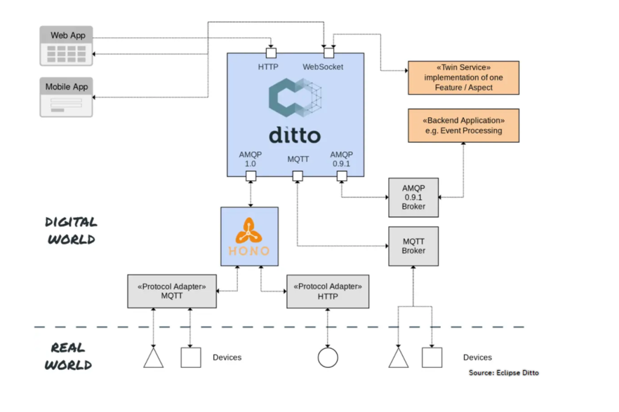
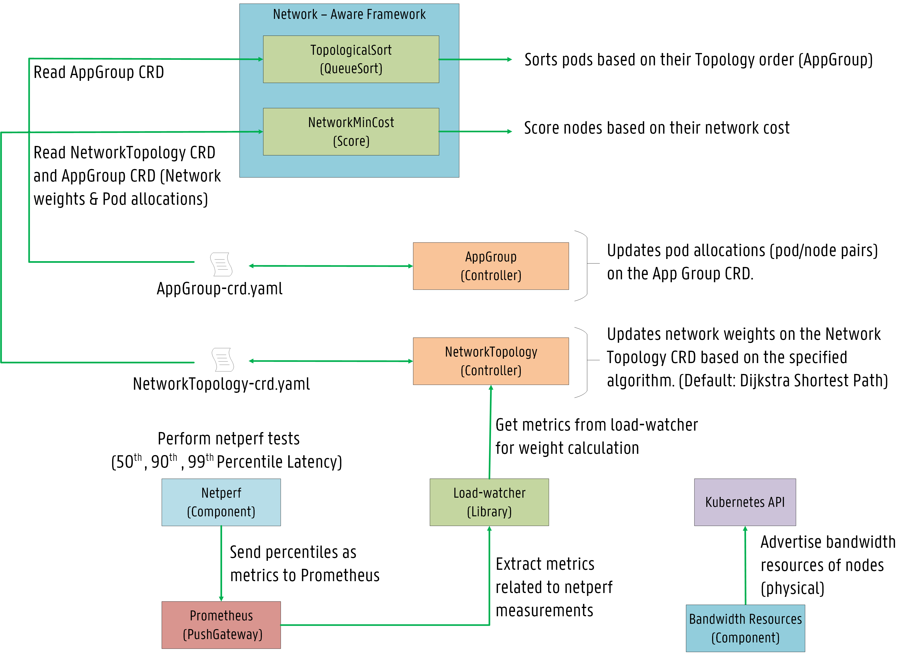
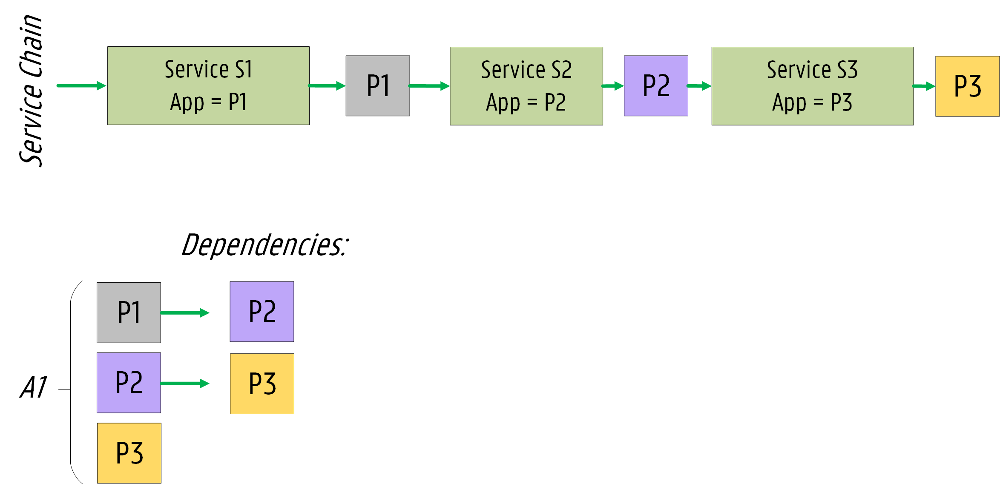
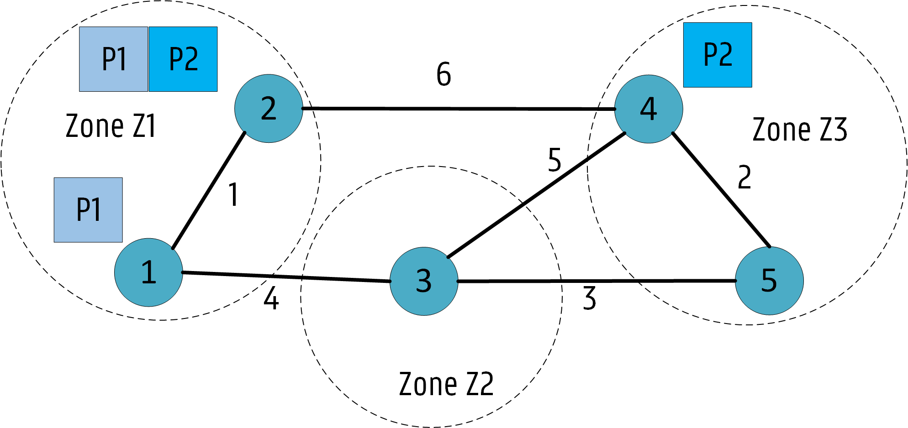

# Network-Aware Scheduling

## Table of Contents

<!-- toc -->
- [Summary](#summary)
- [Motivation](#motivation)
  - [Goals](#goals)
  - [Non-Goals](#non-goals)
- [Use cases/Topologies](#use-cases--topologies)
  - [1 - Spark/Database applications running in Data centers or small scale cluster topologies](#1---sparkdatabase-applications-running-in-data-centers-or-small-scale-cluster-topologies)
  - [2 - Cloud2Edge application running on a multi-region geo-distributed cluster](#2---cloud2edge-application-running-on-a-multi-region-geo-distributed-cluster)
- [Prerequisites](#prerequisites)
- [Proposal - Design & Implementation Details](#proposal---design--implementation-details)
  - [Overview of the System Design](#overview-of-the-system-design)
  - [Application Group CRD (AppGroup)](#application-group-crd-appgroup)
  - [Network Topology CRD (NetworkTopology)](#network-topology-crd-networktopology)
  - [The inclusion of bandwidth in the scheduling process](#the-inclusion-of-bandwidth-in-the-scheduling-process)
    - [Bandwidth Requests via extended resources](#bandwidth-requests-via-extended-resources)
    - [Bandwidth Limitations via the Bandwidth CNI plugin](#bandwidth-limitations-via-the-bandwidth-cni-plugin)
  - [Netperf component](#netperf-component---measuring-latency-in-the-cluster)  
  - [Plugins](#plugins)
    - [Description of the `TopologicalSort` Algorithm (Alpha)](#description-of-the-topologicalsort-algorithm-alpha)
    - [Description of the `NetworkMinCost` Algorithm (Alpha)](#description-of-the-networkmincost-algorithm-alpha)
    - [Description of the `CheckRiskNodeBandwidth` Algorithm (Beta)](#description-of-the-checkrisknodebandwidth-algorithm-beta)
- [Known limitations](#known-limitations)
- [Test plans](#test-plans)
- [Production Readiness Review Questionnaire](#production-readiness-review-questionnaire)
    - [Scalability](#scalability)
    - [Troubleshooting](#troubleshooting)
- [Graduation criteria](#graduation-criteria)
- [Implementation history](#implementation-history)
<!-- /toc -->

# Summary

This proposal describes the behavior of the Network-Aware Scheduling framework
that considers latency and bandwidth in the scheduling decision-making process.

The proposal introduces two custom resources, **AppGroup CRD** and **NetworkTopology CRD**, to maintain 
both the service topology information from application microservice dependencies and the infrastructure 
network topology where network weights between cluster nodes are learned from latency measurements. 
Thus, both application and infrastructure network topology are considered during scheduling. 

The proposal also presents a bandwidth resource component (DaemonSet) to advertise bandwidth resources 
as **extended resources** to allow already available filter/scoring plugins (e.g., `PodFitsResources`, 
`BalancedAlocation`) to consider bandwidth allocation.

To tackle latency and bandwidth in the scheduling process, several plugins are proposed in this document, 
including: 
- `TopologicalSort` (**QueueSort**).
- `NetworkMinCost` (**Score**).
- `CheckRiskNodebandwidth` (**Filter**). 

# Motivation

Recent applications are demanding lower latency.
Scheduling pods only focused on reducing costs are not suitable for applications where low latency plays a major role. 
Applications such as the Internet of Things (IoT) and video services 
would benefit the most from plugins where latency and bandwidth are considered in the decision process 
and not only resource usages (e.g., CPU and RAM). 

Several organizations face latency when using cloud services. 
Distance from servers is usually the primary culprit. 
The best strategy is to reduce the latency between services belonging to the same application. 
This work is inspired by [Service Function Chaining](https://www.sciencedirect.com/science/article/pii/S1084804516301989) (SFC).
Also, bandwidth plays an important role since overloaded nodes would degrade performance. 

We propose a **Network-Aware framework** for Kubernetes focused on delivering low latency to end-users 
and ensuring bandwidth conservation during pod allocations. 

This work significantly extends the previous work open-sourced [here](https://github.com/jpedro1992/sfc-controller) based on the old scheduler extender process.  

## Goals

- Provide a network-aware framework to extend scheduling features of Kubernetes by considering latency and bandwidth.
- Consider different pods as an Application:    
    - The creation of an **Application Group (AppGroup) CRD**.
- Define network weights for each node / zone in the cluster:
    - The creation of a **Network Topology (NetworkTopology) CRD**.
- The advertising of the nodes (physical) bandwidth capacity as [extended resources](https://kubernetes.io/docs/tasks/administer-cluster/extended-resource-node/): 
    - Bandwidth requests and limitations allow filtering overloaded nodes (bandwidth) considered for scheduling.
    - Consider bandwidth requests for scoring plugins (e.g., `MostRequested`, `BalancedAllocation`). 
- Establish a specific order to allocate Pods based on their AppGroup CRD:
    - Implementation of a **QueueSort** plugin based on [Topology Sorting](https://en.wikipedia.org/wiki/Topological_sorting#:~:text=In%20computer%20science%2C%20a%20topological,before%20v%20in%20the%20ordering).
- Near-optimal scheduling decisions based on latency:
    - Implementation of a **Score** plugin based on the [Dijkstra Shortest Path calculation](https://www.geeksforgeeks.org/dijkstras-shortest-path-algorithm-greedy-algo-7/).
- Evaluate the risk of allocating pods on nodes based on their current demand (network bandwidth):
    - Implementation of a **Filter** plugin based on the [Trimaran load-aware scheduler](https://github.com/kubernetes-sigs/scheduler-plugins/tree/master/pkg/trimaran).    

## Non-Goals

- Descheduling due to unexpected outcomes is not addressed in the initial design.
- We plan to combine our plugin with other scoring functions (e.g., `RequestedToCapacityRatio`, `BalancedAllocation`). 
A higher weight must be given to our plugin ensuring low latency is preferred. 
Further evaluations will follow to measure the impact / interoperability with other plugins but are out of the scope of the initial design.   

## Use cases / Topologies 

### 1 - Spark/Database applications running in Data centers or small scale cluster topologies

Efficient pod allocations depend on the infrastructure topology and correspondent resources. 
Data centers and even small cluster topologies benefit from our network-aware framework. 

<p align="center"></p>

<p align="center"></p>

Network latency can be different among the nodes in the infrastructure, impacting the application's response time. 
Latency is a critical requirement for several applications (e.g., [Apache Spark](https://spark.apache.org/), [Redis cluster](https://redis.io/topics/cluster-tutorial)). 
Also, bandwidth plays an important role since pods can be allocated on overloaded nodes (i.e., high incoming traffic), causing performance degradation.

This work focuses on microservice dependencies inspired by SFC. 
For example, in the Redis cluster application, there are several dependencies among the masters and the slaves:

<p align="center"></p>

### 2 - Cloud2Edge application running on a multi-region geo-distributed cluster.

Multi-region Geo-distributed scenarios benefit the most from our framework and network-aware plugins. 

<p align="center"></p>

High latency is a big concern in these topologies, especially for IoT applications (e.g., [Eclipse Hono](https://github.com/eclipse/hono), [Eclipse Cloud2Edge](https://www.eclipse.org/packages/packages/cloud2edge/)). 
For example, in the Cloud2Edge platform, there are several dependencies among the several APIs and MQTT brokers where devices connect to:

<p align="center"></p>

# Prerequisites

This section describes the third-party components needed for our framework.

## Bandwidth

Bandwidth resources will be advertised as extended resources based on a bandwidth resource component open-sourced [here](https://github.com/jpedro1992/network-aware-bandwidth-advertisement). 
Bandwidth limitations will be enforced through the bandwidth CNI plugin. By installing [Calico](https://docs.projectcalico.org/reference/cni-plugin/configuration) as the networking 
plugin, the bandwidth CNI plugin is already installed as default.

## Netperf 

A netperf component will be developed based on [k8s-netperf](https://github.com/leannetworking/k8s-netperf) 
and open-sourced [here](https://github.com/jpedro1992/network-aware-k8s-netperf). 
The NetworkTopology controller and the `NetworkMinCost` plugin need accurate latency measurements 
to find nodes that reduce latency for a particular AppGroup. 

## Prometheus

We plan to use Prometheus as our metrics provider. 
For example, in our experiments, we will install [Kube-prometheus](https://github.com/prometheus-operator/kube-prometheus).

## Load-watcher

The NetworkTopology controller uses a [load-watcher](https://github.com/paypal/load-watcher) component as a library for the 
latency measurements. Also, the `CheckRiskNodebandwidth` plugin uses a load-watcher component 
similar to the Trimaran plugin. Thus, load-watcher can be used as a service or as a library. 

# Proposal - Design & Implementation details

## Overview of the System Design

As an initial design, we plan to implement three plugins:  
- A **QueueSort** function named`TopologicalSort`:
    -  Pods are sorted based on their established dependencies.
- A **Score** function called `NetworkMinCost`:
    - Nodes are scored based on network weights ensuring network latency is minimized for pods belonging to the same application.
- A **Filter** function called `CheckRiskNodebandwidth`. 
    - Nodes are filtered out based on their current network bandwidth.

A [Custom Resource Definition (CRD)](https://kubernetes.io/docs/concepts/extend-kubernetes/api-extension/custom-resources/) has been designed to establish an Application Group (AppGroup CRD). 

Also, another CRD (NetworkTopology CRD) calculates network weights among the nodes / zones in the cluster to be used by the scoring plugin.

Further explanations are given below on how the proposed plugins interact with both CRDs. 

<p align="center"></p>

## Application Group CRD (AppGroup)

We designed an AppGroup CRD for service chains based on the [Pod Group](https://github.com/kubernetes-sigs/scheduler-plugins/blob/master/kep/42-podgroup-coscheduling/README.md) concept introduced for the Co-scheduling plugin. 
The PodGroup establishes a collection of pods of the same type, while the proposed AppGroup associates different pods based on service topology information. 
The AppGroup CRD also records pod allocations (i.e., node/pod pairs) under the status part.

```yaml
# App Group CRD spec
apiVersion: apiextensions.k8s.io/v1
kind: CustomResourceDefinition
metadata:
  annotations:
    api-approved.kubernetes.io: "To be Defined" # edited manually
    controller-gen.kubebuilder.io/version: v0.6.2
  creationTimestamp: null
  name: appgroup.scheduling.sigs.k8s.io
spec:
  group: scheduling.sigs.k8s.io
  names:
    kind: AppGroup
    listKind: AppGroupList
    plural: Appgroups
    shortNames:
      - ag
      - ags
    singular: appgroup
  scope: Namespaced
  versions:
  - name: v1alpha1
    schema:
      openAPIV3Schema:
        description: AppGroup establishes a service dependency graph among different Pods.
        properties:
          apiVersion:
            description: 'APIVersion defines the versioned schema of this representation
              of an object. Servers should convert recognized schemas to the latest
              internal value, and may reject unrecognized values. More info: https://git.k8s.io/community/contributors/devel/sig-architecture/api-conventions.md#resources'
            type: string
          kind:
            description: 'Kind is a string value representing the REST resource this
              object represents. Servers may infer this from the endpoint the client
              submits requests to. Cannot be updated. In CamelCase. More info: https://git.k8s.io/community/contributors/devel/sig-architecture/api-conventions.md#types-kinds'
            type: string
          metadata:
            type: object
          spec:
              description: AppGroup defines the number of Pods and which Pods belong to the group.
              properties:
                numMembers:
                  format: int32
                  type: integer
                  minimum: 1
                  description: Number of Pods belonging to the App Group
                topologySortingAlgorithm:
                  type: string
                  description: The algorithm for TopologyOrder (Status)
                Pods:
                  type: array
                  description: The Pods belonging to the group
                  items:
                    type: object
                    properties:
                      name:
                        type: string
                        description: Pod Name
                      type:
                        type: string
                      required:
                        - name
                        - type
                      dependencies:
                        type: array
                        items:
                          type: object
                          properties:
                            description: Definition of Pod Affinities
                              name:
                                description: Name of the Pod.
                                type: string
                              type:
                                type: string
                              required:
                                - name
                                - type
                            type: object
          status:
            description: Record Pod Allocations (Pod name, Pod id, hostnames).
            properties:
              runningPods:
                description: The number of actively running pods.
                format: int32
                type: integer
                minimum: 0
              podsScheduled:
                type: array
                additionalProperties:
                  name:
                    type: string
                    description: Pod Name
                  replicaID:
                    type: string
                    description: Pod ID
                  hostname:
                    type: string
                    description: Hostname allocating Pod instance
              scheduleStartTime:
                description: ScheduleStartTime of the AppGroup
                format: date-time
                type: string
              topologyCalculationTime:
                description: topologyCalculationTime of the AppGroup
                format: date-time
                type: string
              topologyOrder:
                description: The optimal order to schedule pods on this App Group based on a given algorithm.
                type: array
                items:
                  description: Pod Name and Pod Priority index
                  type: object
                    podName:
                      type: string
                      description: Pod Name
                    index:
                      type: integer
                      default: 1
                      minimum: 1
                      format: int64
                      description: Priority index for each Pod (e.g., 1, 2, ...), 
                                    where an index of 1 means pod should be scheduled first in the 
            type: object
        type: object
    served: true
    storage: true
status:
  acceptedNames:
    kind: ""
    plural: ""
  conditions: []
  storedVersions: []
```

### Example

<p align="center"></p>

```yaml
# Example App Group CRD spec
apiVersion: scheduling.sigs.k8s.io/v1alpha1
kind: AppGroup
metadata:
  name: A1
spec:
  numMembers: 3
  topologySortingAlgorithm: KahnSort
  Pods:
    - name: P1
      type: Pod
      dependencies:
        - name: P2
          type: Pod
    - name: P2
      type: Pod
      dependencies:
        - name: P3
          type: Pod
    - name: P3
      type: Pod
```

An AppGroup controller updates the AppGroup CRD regarding the pods already scheduled in the cluster and the preferred topology order for pod allocations. 

Currently, four algorithms are supported for topological sorting: KahnSort, TarjanSort, ReverseKahn, ReverseTarjan. 
The implementation is based on the work open-sourced [here](https://github.com/otaviokr/topological-sort).
An index is given to each pod based on the sorting algorithm. If the index is equal to 1 means the pod should be allocated first in the AppGroup.

```go
// AppGroupController is a controller that process App groups using provided Handler interface
type AppGroupController struct {
	eventRecorder   record.EventRecorder
	agQueue         workqueue.RateLimitingInterface
	agLister        schedlister.AppGroupLister
	podLister       corelister.PodLister
	agListerSynced  cache.InformerSynced
	podListerSynced cache.InformerSynced
	agClient        schedclientset.Interface
}
```

```go
// AppGroupStatus represents the current state of a app group.
type AppGroupStatus struct {
	// The number of actively running pods.
	RunningPods int32 `json:"runningPods,omitempty"`

	// PodsScheduled defines pod allocations (pod name, pod id, hostname).
	PodsScheduled ScheduledList `json:"podsScheduled,omitempty"`

	// ScheduleStartTime of the group
	ScheduleStartTime metav1.Time `json:"scheduleStartTime,omitempty"`

	// TopologyCalculationTime of the group
	TopologyCalculationTime metav1.Time `json:"topologyCalculationTime,omitempty"`

	// Topology order for TopSort Algorithms
	TopologyOrder TopologyList `json:"topologyOrder,omitempty"`
}

// AppGroupPodsScheduled represents the Pod Affinities of a given Pod
// +protobuf=true
type AppGroupPodsScheduled struct {
	Name      string `json:"name" protobuf:"bytes,1,opt,name=name"`
	ReplicaID string `json:"replicaID" protobuf:"bytes,2,opt,name=replicaID"`
	Hostname  string `json:"hostname,omitempty" protobuf:"bytes,3,opt,name=hostname"`
}

// ScheduledList contains an array of Pod Affinities.
// +protobuf=true
type ScheduledList []AppGroupScheduled

// AppGroupTopology represents the calculated order for the given AppGroup
// +protobuf=true
type AppGroupTopology struct {
	PodName string `json:"podName" protobuf:"bytes,1,opt,name=podName"`
	Index   int64  `json:"index" protobuf:"bytes,2,opt,name=index"`
}

// TopologyList contains an array of Pod orders for TopologySorting algorithm.
// +protobuf=true
type TopologyList []AppGroupTopology
```

### AppGroup Test based on Online Boutique

In this test, an AppGroup is created for the [Online Boutique application](https://github.com/GoogleCloudPlatform/microservices-demo).
It consists of 10 pods, which we named from P1 - P10. 

<p align="center"></p>

As shown below, the preferred order for the KahnSort algorithm is P1, P10, P9, P8, P7, P6, P5, P4, P3, P2. 

We attribute an **index** to each pod to evaluate their topology preference in the **Less function of the TopologicalSort plugin** described [here](#description-of-the-topologicalsort-algorithm-alpha).
The topology list corresponds to:

```go
topologyList = [(P1 1) (P10 2) (P9 3) (P8 4) (P7 5) (P6 6) (P5 7) (P4 8) (P3 9) (P2 10)]
```

<p align="center"></p>

## Network Topology CRD (NetworkTopology)

We also designed a NetworkTopology CRD based on the current [NodeResourceTopology CRD](https://github.com/kubernetes-sigs/scheduler-plugins/tree/master/pkg/noderesourcetopology).
The goal is to calculate network costs for nodes and zones in the cluster based on a specified algorithm.

The controller reacts to node additions, updates, or removals. It updates the cached network graph accordingly to be used for network cost calculation.    

As an initial design, we plan to deploy a single NetworkTopology CRD where all network weights are available. 
 
Experiments will evaluate the performance and feasibility of the network topology CRD. 
We argue that a single CRD for all nodes might impact the system's performance concerning execution time to find the network weights for 
a given node while deploying multiple CRDs has an overhead regarding the system's memory to save all CRDs. 

```yaml
# Network CRD spec
apiVersion: apiextensions.k8s.io/v1
kind: CustomResourceDefinition
metadata:
  annotations:
    api-approved.kubernetes.io: "To be Defined" # edited manually
    controller-gen.kubebuilder.io/version: v0.6.2
  creationTimestamp: null
  name: networkTopology.scheduling.sigs.k8s.io
spec:
  group: scheduling.sigs.k8s.io
  names:
    kind: NetworkTopology
    listKind: NetworkTopologyList
    plural: networktopologies
    shortNames:
      - net-topo
      - nt
    singular: networktopology
  scope: Namespaced
  versions:
    - name: v1alpha1
      schema:
        openAPIV3Schema:
          description: Network Topology describes the cluster network topology.
          properties:
            apiVersion:
              description: 'APIVersion defines the versioned schema of this representation
              of an object. Servers should convert recognized schemas to the latest
              internal value, and may reject unrecognized values. More info: https://git.k8s.io/community/contributors/devel/sig-architecture/api-conventions.md#resources'
              type: string
            kind:
              description: 'Kind is a string value representing the REST resource this
              object represents. Servers may infer this from the endpoint the client
              submits requests to. Cannot be updated. In CamelCase. More info: https://git.k8s.io/community/contributors/devel/sig-architecture/api-conventions.md#types-kinds'
              type: string
            metadata:
              type: object
            spec:
              type: object
              properties:
                metricProvider:
                  type: array
                  additionalProperties:
                    type:
                      type: string
                      description: The type of the metric provider
                    address:
                      type: string
                      description: The address of the metric provider. For example, http://prometheus-k8s.monitoring.svc.cluster.local:9090
                    token:
                      type: string
                      description: The authentication token of the metric provider.
                topologyAlgorithm:
                  type: string
                  description: The algorithm for weight calculation (Status)
                freqUpdate:
                  type: integer
                  description: The frequency update of the network costs (e.g., every 1 min, every 5 min, every 10 min ...)
                  format: int64
                  minimum: 1
                timeRangeInMinutes:
                  type: integer
                  description: The time range preferred for the load-watcher metrics
                  format: int64
                  minimum: 1
            status:
              description: Record Network Weights among zones and nodes.
              properties:
                nodeCount:
                  description: The total number of nodes in the cluster
                  type: int64
                weightCalculationTime:
                  description: weightCalculationTime of the weights
                  format: date-time
                  type: string
                weights:
                  type: array
                  description: weightList contains an array of weightInfo objects.
                  items:
                    algorithmName:
                      type: string
                      description: Algorithm Name (e.g., Dijkstra)
                    costList:
                      description: Record weights for several nodes based on the algorithm
                        type: object
                        properties:
                          origin:
                            type: string
                            description: Node name (Origin)
                          originZone:
                            type: string
                              description: Node Zone name (Origin)
                          destination:
                            type: string
                            description: Node name (Destination)
                          destinationZone:
                            type: string
                              description: Node Zone name (Destination)
                          cost:
                            type: integer
                            default: 0
                            minimum: 0
                            format: int64
                            description: Cost from Origin to Destination
                          type: object
              type: object
          type: object
      served: true
      storage: true
status:
  acceptedNames:
    kind: ""
    plural: ""
  conditions: []
  storedVersions: []
```

### Example

Let's consider the following NetworkTopology CRD as an example: 

```yaml
# Example Network CRD 
apiVersion: scheduling.sigs.k8s.io/v1alpha1
kind: NetworkTopology
metadata:
  name: net-topology-test
  namespace: test-namespace
spec:
  metricProvider:
    type: Prometheus
    address: http://prometheus-k8s.monitoring.svc.cluster.local:9090
  topologyAlgorithm: Dijkstra
  freqUpdate: 5
  timeRangeInMinutes: 30 
```

A NetworkTopology controller updates the CRD regarding network weights calculated based on the specified algorithm. 

```go
// NetworkTopologyController is a controller that process Network Topology using provided Handler interface
type NetworkTopologyController struct {
	eventRecorder        record.EventRecorder
	ntQueue              workqueue.RateLimitingInterface
	ntLister             schedlister.NetworkTopologyLister
	nodeLister           corelister.NodeLister
	ntListerSynced       cache.InformerSynced
	nodeListerSynced     cache.InformerSynced
	ntClient             schedclientset.Interface
	loadWatcherCollector *util.NetworkTopologyCollector // Collector to get data from load watcher. Inspired by the Trimaran plugin.
	lock                 sync.RWMutex                   // lock for network graph and cost calculation.
	nodeCount            int64                          // Number of nodes in the cluster.
	graph                *util.Graph                    // Network Graph for cost calculation.
}
```

```go
// NetworkTopologySpec represents the template of a NetworkTopology.
type NetworkTopologySpec struct {
	// Metric Provider to use when using load watcher as a library
	MetricProvider configTypes.MetricProviderSpec `json:"metricProvider,omitempty"`

	// The algorithm for weight calculation
	TopologyAlgorithm string `json:"topologyAlgorithm,omitempty"`

	// The frequency update of the network costs (e.g., every 1 min, every 5 min, every 10 min ...)
	FreqUpdate int64 `json:"freqUpdate,omitempty"`

	// The time range used for weight calculation in the Prometheus Query
	TimeRangeInMinutes int64 `json:"timeRangeInMinutes,omitempty"`
}

// NetworkTopologyStatus represents the current state of a Network Topology.
type NetworkTopologyStatus struct {
	// The total number of nodes in the cluster
	NodeCount int64 `json:"nodeCount,omitempty"`

	// The calculation time for the weights in the network topology CRD
	WeightCalculationTime metav1.Time `json:"weightCalculationTime,omitempty"`
	// The calculated weights in the topology.
	// +optional
	Weights NetworkTopologyWeightList `json:"weights,omitempty"`
}

// NetworkTopologyWeightList contains an array of NetworkTopologyWeightInfo objects.
// +protobuf=true
type NetworkTopologyWeightList []NetworkTopologyWeightInfo

// NetworkTopologyAlgorithmList contains an array of NetworkTopologyAlgorithmInfo objects.
// +protobuf=true
type NetworkTopologyCostList []NetworkTopologyCostInfo


// NetworkTopologyResourceInfo contains information about one resource type.
// +protobuf=true
type NetworkTopologyWeightInfo struct {
	// Preferred Algorithms
	AlgorithmName string `json:"algorithmName" protobuf:"bytes,1,opt,name=algorithmName"`

	// Costs from a given Origin to a given Destination
	CostList NetworkTopologyCostList `json:"costList" protobuf:"bytes,2,opt,name=costList"`
}

// NetworkTopologyResourceInfo contains information about one resource type.
// +protobuf=true
type NetworkTopologyCostInfo struct {
	// Name of the origin (e.g., Node Name).
	Origin string `json:"origin" protobuf:"bytes,1,opt,name=origin"`

	// Name of the Origin zone (e.g., Node Zone).
	OriginZone string `json:"originZone" protobuf:"bytes,2,opt,name=originZone"`

	// Name of the destination (e.g., Node Name).
	Destination string `json:"destination" protobuf:"bytes,3,opt,name=destination"`

	// Name of the Destination zone (e.g., Node Zone).
	DestinationZone string `json:"destinationZone" protobuf:"bytes,4,opt,name=destinationZone"`

	// Network Cost
	Cost int64 `json:"cost" protobuf:"bytes,5,opt,name=cost"`
}
```

## The inclusion of bandwidth in the scheduling process 

### Bandwidth Requests via extended resources

We plan to advertise the node's (physical) bandwidth capacity of the cluster via [extended resources](https://kubernetes.io/docs/tasks/administer-cluster/extended-resource-node/). 
A bandwidth resource component will be developed to send HTTP requests to the Kubernetes API server regarding the node's bandwidth capacity. 
Also, a PATCH request can be sent manually as the following example:  

```HTTP
PATCH /api/v1/nodes/<your-node-name>/status HTTP/1.1
Accept: application/json
Content-Type: application/json-patch+json
Host: k8s-master:8080

[
  {
    "op": "add",
    "path": "/status/capacity/network.aware.com~1bandwidth",
    "value": "10000000000" 
  }
]
```

Here, the bandwidth capacity of the node is equal to 10 Gbps. 
We prefer to specify bandwidth in sizes of 1 bps (bits per second):

- 1 Mbit/s = 1000000
- 1 Gbit/s = 1000000000
- 10 Gbit/s = 10000000000

The output will show that the Node has a capacity of 10 Gbps:

```HTTP
"capacity": {
  "cpu": "2",
  "memory": "2049008iK",
  "network.aware.com/bandwidth": "10000000000",
```

### Bandwidth Limitations via the Bandwidth CNI plugin

The [bandwidth CNI plugin](https://kubernetes.io/docs/concepts/extend-kubernetes/compute-storage-net/network-plugins/) 
supports pod ingress and egress traffic shaping to limit container bandwidth.
Containers share the host network bandwidth when deployed on the same node. 
Limiting container bandwidth can prevent mutual interference and improve network stability.

The addition of `kubernetes.io/ingress-bandwidth` and `kubernetes.io/egress-bandwidth` annotations 
to the pod configuration file ensures bandwidth limitations are respected:

```yaml
# Example Pod deployment with bandwidth limitations
apiVersion: v1
kind: Pod
metadata:
  annotations:
    kubernetes.io/ingress-bandwidth: 1M
    kubernetes.io/egress-bandwidth: 1M
 ``` 

### Example 

This example shows how extended resources can be combined with bandwidth limitations in the pod configuration file:

```yaml
# Example Pod deployment:  
# bandwidth requests (Extended Resources)
# bandwidth limitations (bandwidth CNI plugin)
apiVersion: v1
kind: Pod
metadata:
  name: network-aware-bandwidth-example
  annotations:
      kubernetes.io/ingress-bandwidth: 10M
      kubernetes.io/egress-bandwidth: 10M
spec:
  containers:
  - name: network-aware-bandwidth-example
    image: example
    resources:
      requests:
        network.aware.com/bandwidth: 10000000 # 10M
      limits:
        network.aware.com/bandwidth: 10000000 # 10M  
 ``` 

This allows to perform filter / score algorithms based on bandwidth resources (e.g., `PodFitsHostResources`, `MostRequested`, `BalancedAllocation`).

## Netperf component - measuring Latency in the cluster

Latency will be monitored through a [netperf](https://github.com/HewlettPackard/netperf) component. 
Netperf tests will be executed based on the nodes available in the infrastructure. 
This allows measuring the latency between nodes / zones. 
As an initial design, we are focused on the **50th, 90th and 99th percentile latency**.

<p align="center"></p>

We plan to create metrics in [Prometheus](https://prometheus.io/) with the measured values with **origin** and **destination** as labels. 
For example:

```go
INFO:root:Metric netperf_p50_latency_microseconds{origin="worker-4", destination="worker-2"} has the value 302
INFO:root:Metric netperf_p90_latency_microseconds{origin="worker-4", destination="worker-2"} has the value 373
INFO:root:Metric netperf_p99_latency_microseconds{origin="worker-4", destination="worker-2"} has the value 413
INFO:root:Metric netperf_p50_latency_microseconds{origin="worker-3", destination="worker-1"} has the value 270
INFO:root:Metric netperf_p90_latency_microseconds{origin="worker-3", destination="worker-1"} has the value 349
INFO:root:Metric netperf_p99_latency_microseconds{origin="worker-3", destination="worker-1"} has the value 411
 ``` 

To address scalability concerns, the load-watcher component will retrieve the latency metrics and network weights will be calculated by the NetworkTopology controller. 

The network graph is recalculated depending on the specified `FreqUpdate` (e.g., every 1 minute, every 5 minutes). 

As a default algorithm, the [Dijkstra Shortest Path](https://www.geeksforgeeks.org/dijkstras-shortest-path-algorithm-greedy-algo-7/) is supported. 
Typically, the time complexity of the Dijkstra algorithm is: `O (V + E log V)`, where V corresponds to Vertices and E to Edges in the infrastructure.  
At a later stage, other algorithms for weight calculation can be added and supported (e.g., [Bellman Ford](https://www.geeksforgeeks.org/bellman-ford-algorithm-dp-23/)).

The netperf component will be developed based on [k8s-netperf](https://github.com/leannetworking/k8s-netperf) and open-sourced [here](https://github.com/jpedro1992/network-aware-k8s-netperf)

## Plugins

### Description of the `TopologicalSort` Algorithm (Alpha)

**Extension point: QueueSort**

Pods belonging to an AppGroup should be sorted based on their topology information. 
The `TopologicalSort` plugin compares the pods' index available in the AppGroup CRD for the preferred sorting algorithm. 

If pods do not belong to an AppGroup or belong to different AppGroups, we follow the strategy of the **less function** provided by the [QoS plugin](https://github.com/kubernetes-sigs/scheduler-plugins/tree/master/pkg/qos).

```go
// Less is the function used by the activeQ heap algorithm to sort pods.
// Sort Pods based on their App Group and corresponding service topology.
// Otherwise, follow the strategy of the QueueSort Plugin
func (ts *TopologicalSort) Less(pInfo1, pInfo2 *framework.QueuedPodInfo) bool {
	p1AppGroup := util.GetAppGroupLabel(pInfo1.Pod)
	p2AppGroup := util.GetAppGroupLabel(pInfo2.Pod)

	if len(p1AppGroup) == 0 || len(p2AppGroup) == 0 { // Follow QoS Sort
		s := &qos.Sort{}
		return s.Less(pInfo1, pInfo2)
	}

	if p1AppGroup == p2AppGroup { // Pods belong to the same App Group
		klog.Infof("Pods: %v and %v from the same appGroup %v", pInfo1.Pod.Name, pInfo2.Pod.Name, p1AppGroup)
		agName := p1AppGroup
		appGroup, err := findAppGroupTopologicalSort(agName, ts)
		if err != nil {
			klog.ErrorS(err, "Error while returning AppGroup")
			s := &qos.Sort{}
			return s.Less(pInfo1, pInfo2)
		}
		var orderP1 = math.MaxInt64
		var orderP2 = math.MaxInt64

		for _, p := range appGroup.Status.TopologyOrder {
			if p.PodName == pInfo1.Pod.Name { //get order of P1
				orderP1 = int(p.Index)
			}
			if p.PodName == pInfo2.Pod.Name { //get order of P2
				orderP2 = int(p.Index)
			}
		}
		klog.Infof("Pod %v order: %v and Pod %v order: %v.", pInfo1.Pod.Name, orderP1, pInfo2.Pod.Name, orderP2)

		// Lower is better, thus invert result!
		return !(orderP1 > orderP2)
	} else { // Pods do not belong to the same App Group: follow the strategy from the QoS plugin
		klog.Infof("Pod %v and %v do not belong to the same appGroup %v", pInfo1.Pod.Name, pInfo2.Pod.Name, p1AppGroup)
		s := &qos.Sort{}
		return s.Less(pInfo1, pInfo2)
	}
}
```

#### Example

Let's consider the Online Boutique application shown previously. 
The AppGroup consists of 10 pods and the topology order based on the KahnSort algorithm is **P1, P10, P9, P8, P7, P6, P5, P4, P3, P2.**

The plugin favors low indexes. Thus, depending on the two pods evaluated in the Less function, the result (bool) is the following: 

<p align="center"></p>

### Description of the `NetworkMinCost` Algorithm (Alpha)

**Extension point: Score**

We propose a scoring plugin called `NetworkMinCost` to favor nodes with the lowest combined shortest path cost based on the pod's AppGroup.

Pod allocations (pod name, pod id, pod hostname) are available in the AppGroup CRD updated by the controller. 

Network weights are available in the NetworkTopology CRD updated by the controller based on the netperf measurements. 
 
If not a single pod belonging to the same AppGroup has been already allocated, 
we score all candidate nodes equally: 

```go
score := framework.MinNodeScore

// Check if Pod belongs to an App Group
agName := util.GetAppGroupLabel(pod)
if len(agName) == 0 { // Score all nodes equally
	return score, framework.NewStatus(framework.Success, "Pod does not belong to an AppGroup: minimum score")
}
```

We plan to combine our scoring plugin with other scoring plugins (e.g., `BalancedAllocation`, `LeastRequestedPriority`, etc). 
We will attribute a higher weight to our plugin to prefer decisions focused on low latency. 
For instance, consider the following scheduler policy config file as an example:

```json
{
"kind" : "Policy",
"apiVersion" : "v1",
"predicates" : [
	{"name" : "PodFitsPorts"},
	{"name" : "PodFitsResources"},
	{"name" : "NoDiskConflict"},
	{"name" : "NoVolumeZoneConflict"},
	{"name" : "MatchNodeSelector"},
	{"name" : "HostName"}
],
"priorities" : [
	{"name" : "LeastRequestedPriority", "weight" : 1},
	{"name" : "BalancedResourceAllocation", "weight" : 1},
	{"name" : "NetworkMinCost", "weight" : 5}
]
}
```

#### Example

##### Build the Network Graph 

Let's consider that our cluster has five nodes `N1 - N5` and three zones `Z1 - Z3`.
As an example, the spec definition of the NetworkTopology CRD is the following: 

```yaml
# Example Network CRD 
apiVersion: scheduling.sigs.k8s.io/v1alpha1
kind: NetworkTopology
metadata:
  name: net-topology-test
  namespace: test-namespace
spec:
  metricProvider:
    type: Prometheus
    address: http://prometheus-k8s.monitoring.svc.cluster.local:9090
  topologyAlgorithm: Dijkstra
  freqUpdate: 5
  timeRangeInMinutes: 30 
```

And at a given moment, the status part of the NetworkTopology CRD is the following:

```yaml
# Status from NetworkTopology CRD 
(...)
          status:
            properties:
              nodeCount: 5
              weightCalculationTime: 2021-10-06 10:00:00
              weights:
                algorithmName: Dijkstra
                - costList:
                  items:
                    - origin: worker-1
                      originZone: Z1
                      destination: worker-2
                      destinationZone: Z1
                      cost: 1
                    - origin: worker-1
                      originZone: Z1
                      destination: worker-3
                      destinationZone: Z2
                      cost: 4
                    - origin: worker-2
                      originZone: Z1
                      destination: worker-4
                      destinationZone: Z3
                      cost: 6
                    - origin: worker-3
                      originZone: Z2
                      destination: worker-4
                      destinationZone: Z3
                      cost: 5
                    - origin: worker-3
                      originZone: Z2
                      destination: worker-5
                      destinationZone: Z3
                      cost: 3
                    - origin: worker-4
                      originZone: Z3
                      destination: worker-5
                      destinationZone: Z3
                      cost: 2
```

Based on the NetworkTopology CRD, the controller has cached the following network graph:
 
 <p align="center"></p>

##### Score nodes for a given pod based on the AppGroup CRD and NetworkTopology CRD

Let's consider that we need to schedule the pod `P3` belonging to the Application group `A1`, 
containing three pods `P1 - P3` with established dependencies:

```yaml
# Example App Group CRD spec
apiVersion: scheduling.sigs.k8s.io/v1alpha1
kind: AppGroup
metadata:
  name: A1
spec:
  numMembers: 3
  Pods:
    - name: P1
      type: Pod
      dependencies:
        podAffinity: P2
    - name: P2
      type: Pod
      dependencies:
        podAffinity: P3
    - name: P3
      type: Pod
```

At a given moment, the status part is the following: 

 ```yaml
# Status from App Group CRD 
(...)        
          status: 
            properties:
              podsScheduled:
                - name: P1
                  type: Pod
                  replicaID: pod1-test1
                  hostname: worker-1
                - name: P1
                  type: Pod
                  replicaID: pod1-test2
                  hostname: worker-2
                - name: P2
                  type: Pod
                  replicaID: pod2-test1
                  hostname: worker-2
                - name: P2
                  type: Pod
                  replicaID: pod2-test2
                  hostname: worker-4
              (...)
```

Four pods have already been allocated: two replicas of `P1` and two replicas of `P2`. 

First, we calculate the accumulated shortest path cost for the candidate node. 
The accumulated cost is returned as the score:

```go
// Check Dependencies of the given pod
var dependencyList []string
for _, p := range appGroup.Spec.Pods {
	if p.Name == pod.Name {
		for _, dependency := range p.Dependencies {
			dependencyList = append(dependencyList, dependency.Name)
		}
	}
}

var cost int64 = 0
// calculate accumulated shortest path, network weighs available in the NetworkTopology CRD
for _, podAllocated := range appGroup.Status.PodsScheduled { // For each pod already allocated 
	for _, dependencyName := range dependencyList { // For each pod dependency
		if podAllocated.Name == dependencyName { // If the pod allocated is an established dependency
			for _, w := range networkTopology.Status.Weights { // Check the weights List
				if w.AlgorithmName == pl.algorithm { // If its the Preferred algorithm
					for _, c := range w.CostList { // For each costInfo in CostList 
					    if c.Origin == nodeName && c.Destination == podAllocated.Hostname { // Find the Cost for the hostname allocating the pod
					        cost += c.Cost // Add the cost to the sum
					    }
				    }
				}
			}
		}
	}
}

// Return Accumulated Cost as score
score = cost

klog.V(6).Infof("pod:%s; node:%s; finalScore=%d", pod.GetName(), nodeName, score)
return score, framework.NewStatus(framework.Success, "Accumulated cost added as score, normalization ensures lower costs are favored")
``` 

Then, we get the maximum and minimum costs for all candidate nodes to normalize the values between 0 and 100. 
After normalization, **nodes with lower costs are favored** since it also corresponds to lower latency:

```go
// NormalizeScore : normalize scores
func (pl *NetworkMinCost) NormalizeScore(ctx context.Context, state *framework.CycleState, pod *v1.Pod, scores framework.NodeScoreList) *framework.Status {
	// Lower scores correspond to lower latency
	// Get Min and Max Scores to normalize between framework.MaxNodeScore and framework.MinNodeScore
	minCost, maxCost := GetMinMaxScores(scores)

	for i, nodeScore := range scores {
		if maxCost != minCost { // Avoid division by 0
			// node_normalized_cost = MAX_SCORE * ( ( nodeScore - minCost) / (maxCost - minCost)
			// nodeScore = MAX_SCORE - node_normalized_cost
			scores[i].Score = framework.MaxNodeScore - (framework.MaxNodeScore * (nodeScore.Score - minCost/(maxCost-minCost)))
		} else { // If maxCost = minCost
			scores[i].Score = framework.MaxNodeScore - (framework.MaxNodeScore * (nodeScore.Score - minCost))
		}
	}
	return nil
}
```

<p align="center"></p>

### Description of the `CheckRiskNodebandwidth` Algorithm (Beta)

**Extension point: Filter**

Allocating pods on nodes without considering their current demand (bandwidth) could be risky. 
The `CheckRiskNodebandwidth` plugin evaluates the risk of allocating pods on nodes based on their bandwidth usage (i.e., network I/O). 
It is based on the `LoadVariationRiskBalancing` plugin developed for the [Trimaran scheduler](https://github.com/kubernetes-sigs/scheduler-plugins/tree/master/pkg/trimaran).

The plugin employs the `load-watcher` component to collect measurements from the nodes as described [here](https://github.com/kubernetes-sigs/scheduler-plugins/tree/master/pkg/trimaran).

The (normalized) node risk is defined as a combined measure of the **average** (i.e., avg) and **standard deviation** (i.e., std) of the node bandwidth utilization. 
It is given by

```latex
node_risk = [avg + margin * std^{1/sensitivity}] / 2
```

The two parameters: **margin**​ and **sensitivity**​, impact the node risk due to bandwidth variation. 
To magnify the impact of low variations, the **std** quantity is raised to a fractional power with the **sensitivity** parameter being the root power, 
while the **margin** parameter scales the variation quantity. 

The recommended values for the margin​ and sensitivity parameters are 1 and 2, respectively. 
Each of the two added terms is bounded between 0 and 1. Then, dividing by 2 normalizes the node risk between 0 and 1.

Then, if the **node_risk** is higher than the `RiskThreshold` defined in the plugin config file, the node is removed and not considered for scoring. 

```go
func (rs *resourceStats) evaluateRisk(margin float64, sensitivity float64, riskThreshold float64) bool {
    
    // make sure values are within bounds
    rs.req = math.Max(rs.req, 0)
    rs.usedAvg = math.Max(math.Min(rs.usedAvg, rs.capacity), 0)
    rs.usedStdev = math.Max(math.Min(rs.usedStdev, rs.capacity), 0)

    // calculate average factor
    mu := (rs.usedAvg + rs.req) / rs.capacity
    mu = math.Max(math.Min(mu, 1), 0)

    // calculate deviation factor
    sigma := rs.usedStdev / rs.capacity
    sigma = math.Max(math.Min(sigma, 1), 0)
	
    // apply root power
    if sensitivity >= 0 {
	    sigma = math.Pow(sigma, 1/sensitivity)
    }

    // apply multiplier
    sigma *= margin
    sigma = math.Max(math.Min(sigma, 1), 0)

    // Calculate node risk
    nodeRisk := (mu + sigma) / 2
    klog.V(6).Infof("mu=%f; sigma=%f; margin=%f; sensitivity=%f; risk=%f", mu, sigma, margin, sensitivity, nodeRisk)

    // Return if the calculated nodeRisk passes the RiskThreshold (bool)
    return fitsThreshold(riskThreshold, nodeRisk)
}
```

Thus, the `CheckRiskNodebandwidth` plugin has the three following configuration parameters:

- `safeVarianceMargin`: Multiplier (non-negative floating point) of standard deviation. (Default: 1)
- `safeVarianceSensitivity`: Root power (non-negative floating point) of standard deviation. (Default: 2)
- `RiskThreshold`: The threshold for the node risk (between 0 and 1). Nodes with higher risk are filtered out. (Default: 0.75)

In summary, the `CheckRiskNodebandwidth` plugin filters out nodes with a high risk of the bandwidth exceeding the node available capacity. 

#### Example

Let's consider that our cluster has three nodes `N1 - N3`, and the pod to be scheduled has a bandwidth requirement of 100 Mbps (Bandwidth). 
All nodes have a link capacity of 1 Gbps.

The mean (M) and standard deviation (V) are extracted from the load-watcher component. 
Otherwise, we assume that M and V are the requested amount and zero, respectively.
The `node_risk` is calculated for all candidate nodes. 

As a result, both `N1`, `N2` will be considered for scoring, 
while `N3` is filtered out due to its **high risk (0.787).**

<p align="center"></p>

# Known limitations

- CRDs installation:

    The `TopologicalSort` plugin depends on the specification of an AppGroup CRD for different pods.

    The `NetworkMinCost` plugin depends on both CRDs (AppGroup CRD and NetworkTopology CRD).

    Without both CRDs, the plugins `TopologicalSort` and `NetworkMinCost` will follow a default strategy: queue sorting based on the QoS plugin and scoring all nodes equally, respectively.

- QueueSort extension point:

    The `TopologicalSort` plugin makes use of the QueueSort extension point, so 
    it can't be combined with other plugins also accessing this extension point. 
    Therefore, when pods do not belong to an AppGroup, we follow the strategy implemented by the QoS sort plugin. 

# Test plans

Unit tests and Integration tests will be added: 

- Unit Tests
    - For both CRDs (AppGroup and NetworkTopology) concerning the controllers and respective informers.
    - For all plugins: `TopologicalSort`, `CheckRiskNodebandwidth` and `NetworkMinCost`.
- Integration Tests
    - Default configurations (plugins enabled / disabled).
    - Impact of both plugins in the scheduling flow (performance, resource usage).
    - Impact of both CRDs (AppGroup and NetworkTopology).
    - Impact of the netperf component (performance, frequency measurement, accuracy).
- End-to-end tests
    - Comprehensive E2E testing would graduate the framework from Alpha to Beta.

# Production Readiness Review Questionnaire

## Scalability

*   Will enabling / using this feature result in any new API calls? 

    No.

*   Will enabling / using this feature result in introducing new API types? 

    No.

*   Will enabling / using this feature result in any new calls to the cloud provider? 

    No.

*   Will enabling / using this feature result in increasing size or count of the existing API objects? 

    No.

*   Will enabling / using this feature result in increasing time taken by any operations covered by [existing SLIs/SLOs](https://git.k8s.io/community/sig-scalability/slos/slos.md#kubernetes-slisslos)? 

    We acknowledge the overhead introduced by our NetworkTopology controller and corresponding `NetworkMinCost` plugin. 
    However, to make better decisions concerning latency, we need accurate and up-to-date information regarding cluster latency. 
    
    Experiments are planned to evaluate the overhead of our design in different topologies. 
    We also aim to study the frequency of the netperf measurements and the trade-off between monitoring frequencies and accuracy.

    Nevertheless, it should be a negligible increase concerning execution time since our scoring plugin extracts topology information 
    from the NetworkTopology CRD and application information from the AppGroup CRD.   

*   Will enabling / using this feature result in non-negligible increase of resource usage (CPU, RAM, disk, IO, ...) in any components? 

    No - Metrics / Information are available in both CRDs and only pulled by our plugins when needed. 
    It should be a negligible increase in terms of resource usage. Experiments are planned to evaluate the overhead of the 
    netperf component and both controllers (AppGroup CRD and NetworkTopology CRD).  
    
    In addition, the algorithms provided run in linear and logarithmic time for the number of nodes.


## Troubleshooting

*   How does this feature react if the API server and/or etcd is unavailable? 

     Running pods are not affected. Any new submissions would be rejected by scheduler.

*   What are other known failure modes?

     N/A

*   What steps should be taken if SLOs are not being met to determine the problem?

     N/A

# Graduation criteria

- Alpha 
    - [ ]  The implementation of the AppGroup controller (AppGroup CRD).
    - [ ]  The implementation of the NetworkTopology controller (NetworkTopology CRD).
    - [ ]  The development of the netperf component. 
    - [ ]  The development of the bandwidth resource component.
    - [ ]  The implementation of the `TopologicalSort` plugin.
    - [ ]  The implementation of the `NetworkMinCost` plugin.
    - [ ]  Unit tests and integration tests from Test plans.

- Beta 
    - [ ]  The implementation of the `CheckRiskNodebandwidth` plugin.
    - [ ]  Add E2E tests.
    - [ ]  Provide beta-level documentation.

# Implementation history

- 2021-9-9: Presentation to the Kubernetes sig-scheduling community. 
Received feedback and comments on the design and implementation. Recording available [here](https://youtu.be/D9jSqUiaq1Q). 
- 2021-10-15: Initial KEP sent out for review, including Summary, Motivation, Proposal, Test plans and Graduation criteria.
